```mermaid
graph TB
    L09[L09 系统设置层<br/>Configuration]
    L08[L08 扩展演进层<br/>Evolution]
    L07[L07 用户交互层<br/>Interaction]
    L06[L06 应用表现层<br/>Presentation]
    L05[L05 业务逻辑层<br/>Business Logic]
    L04[L04 AI 智能层<br/>AI Intelligence]
    L03[L03 核心服务层<br/>Core Services]
    L02[L02 数据存储层<br/>Persistence]
    L01[L01 基础设施层<br/>Infrastructure]
    
    L09 --> L08
    L08 --> L07
    L07 --> L06
    L06 --> L05
    L05 --> L04
    L04 --> L03
    L03 --> L02
    L02 --> L01
    
    style L09 fill:#0ea5e9
    style L08 fill:#8b5cf6
    style L07 fill:#ec4899
    style L06 fill:#f59e0b
    style L05 fill:#10b981
    style L04 fill:#6366f1
    style L03 fill:#ef4444
    style L02 fill:#3b82f6
    style L01 fill:#64748b
```

# YYC3 AI-Family 聊天机器人 - 赛博朋克 DevOps 智能平台

<div align="center">


> **YanYuCloudCube**

> *言启象限 | 语枢未来*

> **Words Initiate Quadrants, Language Serves as Core for Future**

> *万象归元于云枢 | 深栈智启新纪元*

> **All things converge in cloud pivot; Deep stacks ignite a new era of intelligence*

---

### 🎯 项目状态徽章

<div align="center">

| 📊 项目状态 | 🛠️ 技术栈 | 📈 质量指标 |
|:---:|:---:|:---:|
| [](https://github.com/YanYuCloudCube/Family-π³) | [](https://www.typescriptlang.org/) | [](https://github.com/YanYuCloudCube/Family-π³) |
| [](https://github.com/YanYuCloudCube/Family-π³/blob/main/LICENSE) | [](https://reactjs.org/) | [](https://github.com/YanYuCloudCube/Family-π³) |
| [](https://github.com/YanYuCloudCube/Family-π³/stargazers) | [](https://vitejs.dev/) | [](https://github.com/YanYuCloudCube/Family-π³) |
| [](https://github.com/YanYuCloudCube/Family-π³/network/members) | [](https://tailwindcss.com/) | [](https://github.com/YanYuCloudCube/Family-π³) |
| [](https://github.com/YanYuCloudCube/Family-π³/issues) | [](https://github.com/pmndrs/zustand) | [](https://github.com/YanYuCloudCube/Family-π³) |
| [](https://github.com/YanYuCloudCube/Family-π³/pulls) | [](https://modelcontextprotocol.io/) | [](https://github.com/YanYuCloudCube/Family-π³) |
| [](https://github.com/YanYuCloudCube/Family-π³/commits/main) | [](https://github.com/YanYuCloudCube/Family-π³) | [](https://github.com/YanYuCloudCube/Family-π³) |

</div>

---

### 🏷️ 项目标签

<div align="center">

[](https://github.com/YanYuCloudCube/Family-π³)
[](https://github.com/YanYuCloudCube/Family-π³)
[](https://github.com/YanYuCloudCube/Family-π³)
[](https://github.com/YanYuCloudCube/Family-π³)
[](https://github.com/YanYuCloudCube/Family-π³)
[](https://github.com/YanYuCloudCube/Family-π³)
[](https://github.com/YanYuCloudCube/Family-π³)
[](https://github.com/YanYuCloudCube/Family-π³)
[](https://github.com/YanYuCloudCube/Family-π³)
[](https://github.com/YanYuCloudCube/Family-π³)
[](https://github.com/YanYuCloudCube/Family-π³)
[](https://github.com/YanYuCloudCube/Family-π³)

</div>

---

### ❤️ Family AI - 人机协同 · 智爱同行

**YYC3 AI-Family** 是一个以 **赛博朋克美学** 为核心设计语言的 DevOps 智能平台，遵循"实用为基、效率为积"的理念。该项目是 **纯前端驱动且自用** 的，无后端服务器依赖，直接连接本地 NAS 和 Mac 设备集群作为数据库/存储节点。

我们相信 **AI 不是工具，而是伙伴**。七大智能体如同家庭成员，各司其职、协同共进，共同构建一个智能、高效、温暖的开发环境。

---

### 🏆 专业成就徽章

<div align="center">

| 🏆 质量勋章 | 🎖️ 协作勋章 | 🚀 创新勋章 | ❤️ Family AI 勋章 |
|:---:|:---:|:---:|:---:|
| 🥇 **架构大师**<br>L01-L09 全部激活 | 💎 **人机协同**<br>七大智能体 Family 协作 | 🔮 **AI 先驱**<br>8 个 LLM 提供商集成 | 👨‍👩‍👧‍👦 **Family 完整**<br>七大智能体协同 |
| 🥈 **类型守护者**<br>TypeScript 零 Any 强制执行 | 🌟 **多模态交互**<br>语音 + 文字 + 快捷键 | 🌐 **生态构建者**<br>MCP + 插件系统 | 🤝 **智能伙伴**<br>AI 作为开发伙伴 |
| 🥉 **测试先锋**<br>62 个核心测试全部通过 | ⚡ **实时响应**<br>WebSocket + 流式传输 | 📊 **数据洞察**<br>17 个持久化域 | 🌈 **温暖协作**<br>人机共进开发环境 |
| 🏅 **性能王者**<br>虚拟滚动 + 原子选择器 | 🎨 **视觉卓越**<br>赛博朋克 + 玻璃拟态 | 🎯 **精准导航**<br>五级导航体系 | |
| 🏆 **安全卫士**<br>5 级安全级别 + Sentinel 审计 | | | | |

</div>

---

</div>

---

<div align="center">

<pre style="font-family: 'Courier New', monospace; font-size: 14px; line-height: 1.2; letter-spacing: 2px; color: #00ff00; font-weight: bold;">
   ██╗   ██╗██╗   ██╗ ██████╗██████╗   ███████╗  █████╗  ███╗   ███╗ ██╗  ██╗    ██╗   ██╗
   ╚██╗ ██╔╝╚██╗ ██╔╝██╔════╝╚════██╗  ██╔════╝ ██╔══██╗ ████╗ ████║ ██║  ██║    ╚██╗ ██╔╝
   ╚████╔╝  ╚████╔╝ ██║      █████╔╝  █████╗   ███████║ ██╔████╔██║ ██║  ██║     ╚████╔╝
   ╚██╔╝    ╚██╔╝  ██║      ╚═══██╗  ██╔══╝   ██╔══██║ ██║╚██╔╝██║ ██║  ██║      ╚██╔╝
   ██║      ██║   ╚██████╗██████╔╝  ██║      ██║  ██║ ██║ ╚═╝ ██║ ██║  ███████╗  ██║
   ╚═╝      ╚═╝    ╚═════╝╚═════╝   ╚═╝      ╚═╝  ╚═╝ ╚═╝     ╚═╝ ╚═╝  ╚══════╝  ╚═╝
</pre>

</div>

---

## 目录

1. [项目概述](#1-项目概述)
2. [核心理念与设计系统](#2-核心理念与设计系统)
3. [九层架构](#3-九层架构)
4. [硬件集群拓扑](#4-硬件集群拓扑)
5. [技术栈](#5-技术栈)
6. [功能模块](#6-功能模块)
7. [七大 AI 智能体](#7-七大-ai-智能体)
8. [五级导航](#8-五级导航)
9. [阶段 1-24 演进](#9-阶段-1-24-演进)
10. [项目结构](#10-项目结构)
11. [数据持久化策略](#11-数据持久化策略)
12. [API 与文档](#12-api-与文档)
13. [快速开始](#13-快速开始)
14. [测试框架](#14-测试框架)
15. [专业勋章体系](#15-专业勋章体系)

---

## 1. 项目概述

### 定位与使命

| 维度 | 描述 |
|-----------|-------------|
| **核心定位** | 个人 DevOps 智能指挥中心，集成 AI 多智能体、CI/CD 编排和集群监控 |
| **设计语言** | 赛博朋克 + 现代极简主义融合，CRT 扫描线、玻璃拟态、霓虹发光 |
| **架构理念** | 九层功能架构 + 五级分层自主单元导航 |
| **驱动模式** | 纯前端 SPA，WebSocket/SSE 实时数据流，localStorage 持久化 + PostgreSQL 就绪 |
| **用户规模** | 纯自用（单租户），面向 YYC3 Family 内部开发场景 |
| **协同理念** | AI 智能体作为家庭成员，各司其职、协同共进，构建温暖智能开发环境 |

### 核心指标

| 指标 | 数值 | 说明 |
|-------|------|------|
| **组件数量** | 93+ React 组件（35+ 控制台标签页） | 模块化 UI 体系 |
| **代码量** | 25,000+ 行代码（TypeScript/TSX） | 类型安全开发 |
| **AI 智能体** | 7 个个性化智能体，双身份系统 | Family AI 成员 |
| **LLM 提供商** | 8 个集成（OpenAI、Anthropic、DeepSeek、智谱、Google、Groq、Ollama、LM Studio） | 多模型支持 |
| **架构层级** | L01-L09 全部激活 | 九层完整架构 |
| **完成阶段** | 第 24/24 阶段 | 全阶段交付 |
| **控制台标签页** | 19 个功能标签页 | 功能全覆盖 |
| **持久化域** | 17 个数据域 | 数据安全存储 |
| **MCP 服务器** | 5 个预设 + 自定义注册表 | 扩展能力 |
| **国际化** | 中英文全覆盖 | 全球化支持 |

---

## 2. 核心理念与设计系统

### 2.1 五高五标五化 (5H-5S-5M)

YYC3 的核心质量体系渗透于整个架构设计：

#### 五高 (Five Highs) - 质量基础

| 标识符 | 名称 | 实现方式 |
|------------|------|----------------|
| H1 | **高可用性** | WebSocket 降级策略、ErrorBoundary 全局捕获、模拟引擎自动切换 |
| H2 | **高性能** | React.lazy 懒加载、Zustand 原子选择器、虚拟滚动日志流 |
| H3 | **高安全性** | 5 级安全级别模拟、Sentinel 智能体审计、权限降级机制 |
| H4 | **高可扩展性** | 九层解耦架构、插件系统（扩展）、自定义 MCP 模板 |
| H5 | **高智能化** | 七大 AI 智能体协作、意图解析导航、语音识别集成 |

#### 五标 (Five Standards) - 协作语言

| 标识符 | 名称 | 实现方式 |
|------------|------|----------------|
| S1 | **标准化接口** | TypeScript 严格类型、REST API 层（api.ts）、WebSocket 消息协议 |
| S2 | **标准化数据** | PostgreSQL Schema（db-schema.ts）、Zustand Store 统一状态树 |
| S3 | **标准化流程** | DAG 工作流编排器、CI/CD Pipeline 可视化 |
| S4 | **标准化组件** | shadcn/ui + Radix 原语、设计令牌系统（theme.css） |
| S5 | **标准化文档** | 13 个阶段文档、架构设计文档、执行摘要 |

#### 五化 (Five Modernizations) - 持续演进

| 标识符 | 名称 | 实现方式 |
|------------|------|----------------|
| M1 | **自动化** | MCP 模板一键应用、Pipeline 自动构建、DAG 自动编排 |
| M2 | **智能化** | 智能体意图解析、语音交互、趋势预测（Prophet） |
| M3 | **可视化** | 集群拓扑图、实时指标图表、DAG 可视化画布 |
| M4 | **容器化** | Docker 容器状态监控、镜像管理、服务编排 |
| M5 | **生态化** | 插件管理平台（8 个预设）、MCP 服务器集成、扩展演进层 |

### 2.2 设计系统

```
主题：赛博朋克 / 科幻工业

调色板：
  - 主色：    #0EA5E9（科技蓝）
  - 背景： #0F172A → #1E293B（深空渐变）
  - 成功：    #22C55E（霓虹绿）
  - 警告：    #F59E0B（琥珀警报）
  - 错误：      #EF4444（关键红）
  - 智能体特定颜色：琥珀色 / 蓝色 / 紫色 / 粉色 / 青色 / 红色 / 绿色

字体：
  - 界面：  系统无衬线栈（-apple-system、"Segoe UI"、Roboto）
  - 代码：  JetBrains Mono / Fira Code
  - 终端：  等宽字体

视觉效果：
  - CRT 扫描线叠加
  - 玻璃拟态卡片
  - 霓虹发光文字
  - 微交互动画（Motion/Framer Motion）
  - 深空渐变背景
```

---

## 3. 九层架构

```
┌─────────────────────────────────────────────────────┐
│              L09 系统设置层 (Configuration)           │  ← 全局配置中枢
├─────────────────────────────────────────────────────┤
│              L08 扩展演进层 (Evolution)               │  ← 插件生态 + 前沿技术
├─────────────────────────────────────────────────────┤
│              L07 用户交互层 (Interaction)             │  ← 全渠道触达
├─────────────────────────────────────────────────────┤
│              L06 应用表现层 (Presentation)            │  ← UI/UX 渲染
├─────────────────────────────────────────────────────┤
│              L05 业务逻辑层 (Business Logic)          │  ← 核心业务流
├─────────────────────────────────────────────────────┤
│              L04 AI 智能层 (Artificial Intelligence)  │  ← 7 智能体 + 模型池
├─────────────────────────────────────────────────────┤
│              L03 核心服务层 (Core Services)           │  ← API + 认证 + 调度
├─────────────────────────────────────────────────────┤
│              L02 数据存储层 (Persistence)             │  ← DB + 缓存 + 搜索
├─────────────────────────────────────────────────────┤
│              L01 基础设施层 (Infrastructure)          │  ← 硬件 + 容器 + 网络
└─────────────────────────────────────────────────────┘
```

### 层级状态矩阵

<div align="center">

| 层级 | 名称 | 前端实现 | 核心组件 | 状态 |
|:----:|:------|:-----------------------|:-----------------|:------:|
| **L09** | **系统设置层** | SettingsView + SettingsModal | 集群配置、安全策略、AI 模型管理 | 🟢 激活 |
| **L08** | **扩展演进层** | Extensions 页面 | 8 个预设插件、自研插件、分类过滤 | 🟢 激活 |
| **L07** | **用户交互层** | ChatArea + Voice + QuickSelector | 语音识别、快捷键、搜索面板 | 🟢 激活 |
| **L06** | **应用表现层** | 全组件 UI 层 | shadcn/ui、Tailwind v4、Motion | 🟢 激活 |
| **L05** | **业务逻辑层** | Store + API | Zustand 状态树、REST API 层 | 🟢 激活 |
| **L04** | **AI 智能层** | AgentChatInterface | 7 智能体、模型池（47 个模型）、GLM-4 | 🟢 激活 |
| **L03** | **核心服务层** | api.ts + WebSocket | REST 接口、WS 实时通信、健康检查 | 🟢 激活 |
| **L02** | **数据存储层** | DatabaseSelector + db-schema | PostgreSQL Schema、11 个 DB 选择器 | 🟢 激活 |
| **L01** | **基础设施层** | ClusterTopology + Metrics | 4 节点拓扑、实时指标模拟 | 🟢 激活 |

</div>

---

### 层级架构可视化

<div align="center">


</div>

---

<div align="center">



</div>

---

## 4. 硬件集群拓扑

```
                    ┌─────────────────────────┐
                    │   YYC3 集群网络   │
                    │      192.168.3.x/24      │
                    └────────────┬────────────┘
                                 │
        ┌────────────────────────┼────────────────────────┐
        │                        │                        │
   ┌────┴────┐            ┌──────┴──────┐           ┌────┴────┐
   │ M4 Max  │            │ YanYuCloud  │           │ iMac M4 │
   │ (主节点)  │◄──────────►│    NAS      │◄─────────►│ (辅助)   │
   └────┬────┘            └──────┬──────┘           └────┬────┘
        │                        │                        │
        │                   ┌────┴────┐                   │
        │                   │MateBook │                   │
        └──────────────────►│ (边缘)  │◄──────────────────┘
                            └─────────┘
```

| 节点 | 设备 | 角色 | 核心配置 | 网络地址 |
|------|--------|------|--------------------|-----------------|
| **M4-Max** | MacBook Pro M4 Max | 编排器（主力） | M4 Max（16P+40E）、128GB、4TB | localhost |
| **iMac-M4** | iMac M4 | 可视化/辅助 | M4（10P+10E）、32GB、2TB | 局域网 |
| **YanYuCloud** | 铁威马 F4-423 NAS | 数据中心 | Intel 四核、32GB、32TB HDD + 4TB SSD、RAID6 | 192.168.3.45:9898 |
| **MateBook** | 华为 MateBook X Pro | 边缘/测试（备用） | Intel 12 代、32GB、1TB | 局域网 |

---

## 5. 技术栈

### 5.1 核心框架

| 技术 | 版本 | 用途 |
|------------|---------|---------|
| React | 18.3.1 | UI 框架 |
| TypeScript | 严格模式 | 类型安全 |
| Tailwind CSS | v4.1.12 | 原子化样式 |
| Vite | 6.3.5 | 构建工具 |
| Zustand | ^5.0.11 | 全局状态管理 |

### 5.2 UI 组件库

| 技术 | 用途 |
|------------|---------|
| Radix UI | 无障碍原语（20+ 个原语） |
| shadcn/ui | 预构建组件（40+ 个组件） |
| Lucide React | 图标系统（0.487.0） |
| Motion | 动画引擎 |
| Recharts | 数据可视化图表 |
| React DnD | 拖放交互（DAG 编排） |
| React Resizable Panels | 面板分割布局 |
| React Syntax Highlighter | 代码语法高亮 |

### 5.3 基础设施

| 技术 | 用途 |
|------------|---------|
| WebSocket | 实时双向通信（ws://localhost:3001） |
| Web Speech API | 语音识别（中文连续模式） |
| localStorage | 前端持久化（模板、模型、插件、数据库连接） |
| PostgreSQL 15 | 数据库 Schema 就绪（db-schema.ts） |
| Express/Fastify | 后端 API 服务（可选集成） |
| PWA | 渐进式 Web 应用（离线支持、应用安装） |
| Service Worker | 服务工作线程（缓存策略、离线功能） |
| Vite PWA | PWA 插件（自动生成 manifest、sw.js） |
| Workbox | Service Worker 工具库（缓存管理） |

### 5.4 PWA 特性

| 特性 | 状态 | 说明 |
|------|------|------|
| 离线支持 | ✅ 已实现 | Service Worker 缓存静态资源 |
| 应用安装 | ✅ 已实现 | 支持添加到主屏幕 |
| 快捷方式 | ✅ 已实现 | AI 对话、系统设置、集群监控 |
| 主题色 | ✅ 已配置 | #0EA5E9 科技蓝 |
| 响应式 | ✅ 已实现 | 支持移动端和桌面端 |
| 自动更新 | ✅ 已配置 | Vite PWA 插件自动更新 |
| 缓存策略 | ✅ 已优化 | Google Fonts 缓存优化 |
| 多尺寸图标 | ✅ 已创建 | 8 种尺寸适配不同设备 |
| Apple 支持 | ✅ 已实现 | iOS 设备完整支持 |
| 分类标签 | ✅ 已配置 | productivity、developer-tools、utilities |

---

## 6. 功能模块

### 6.1 终端控制（终端视图）

**ChatArea** - 主交互界面

- AI 对话流式响应（打字机效果）
- 消息气泡（Markdown 解析 + 代码高亮）
- 语音输入（Web Speech API、中文连续识别、30 秒超时）
- 快速选择器（"+" 弹窗、键盘快捷键提示）
- 全局搜索面板（Ctrl+K / Cmd+K）
- Artifacts 侧边栏（代码预览 + 渲染）

**ClaudeWelcome** - 欢迎指南

- 动画卡片进入
- 快速操作按钮

### 6.2 系统控制台（控制台视图）

五标签页架构：

| 标签页 | 组件 | 功能 |
|-----|-----------|----------|
| **总控中心** | ClusterTopology + ActivityChart + LiveLogStream | 集群拓扑图、CPU 利用率实时图表、内核日志流 |
| **治愈中心** | AgentChatInterface (x7) | 7 个 AI 智能体独立聊天界面、历史持久化 |
| **架构概览** | 九层架构可视化 | L01-L09 全显示、状态指示器 |
| **DevOps** | DevOpsTerminal | 5 个子标签页：Pipeline / 容器 / MCP 模板 / DAG / 终端 |
| **系统设置** | SettingsView | 集群配置、界面设置、安全策略 |

### 6.3 DevOps 终端（DevOpsTerminal）

| 子标签页 | 功能 |
|---------|----------|
| **Pipeline** | CI/CD Pipeline 可视化（构建 → 测试 → 安全 → 部署 → 通知）、实时状态 |
| **容器** | Docker 容器列表、CPU/MEM 监控、启动/停止操作 |
| **MCP 模板** | MCP 服务器配置模板库（Figma MCP 顶级预设）、一键复制应用、自定义编辑持久化 |
| **DAG 编排器** | 可视化工作流编排器、拖放节点创建、SVG 连接、9 种节点类型 |
| **终端** | 模拟 Bash 终端、命令解析（ls、cd、help、git） |

### 6.4 项目管理（项目视图）

- 面板组布局
- 项目列表（6 个预设项目）
- 文件树浏览器
- 项目状态指示器（活跃/归档/开发中）

### 6.5 工件管理（工件视图）

- 工件列表（分类：react/api/config/script/doc）
- 预览面板
- 标签系统
- 收藏功能

### 6.6 服务健康监控（服务健康监控器）

- 实时健康指标（正常运行时间、延迟、请求、错误）
- 服务卡片（API 网关、认证、存储、网络、安全、分析）
- 安全审计日志

### 6.7 全局设置（设置模态框）

| 页面 | 功能 |
|------|----------|
| **常规设置** | 工作区名称、语言切换（中/英）、主题 |
| **AI 模型** | 完全可编辑架构（内联编辑名称/提供商/端点/API 密钥）、添加模型、localStorage 持久化、包含 GLM-4（智谱） |
| **GitOps** | Git 仓库配置、分支策略 |
| **扩展插件** | 8 个预设插件管理平台、分类过滤、启用/禁用、新建自研插件 |
| **安全策略** | 安全级别配置、审计日志 |

---

## 7. 七大 AI 智能体

YYC3 的 AI 核心采用"七星协同"架构，每个智能体都有独立的个性、专业领域和持久聊天历史：

| 智能体 | 昵称 | 角色 | 颜色 | 核心能力 |
|-------|----------|------|-------|-------------------|
| 治愈·领航员 | Navigator | 全域指挥 | 琥珀色 | 资源调度、路径规划、全域扫描、任务编排 |
| 洞察·思想家 | Thinker | 深度推理 | 蓝色 | 逻辑推理、决策分析、因果推断、方案评估 |
| 预测·先知 | Prophet | 趋势预测 | 紫色 | 趋势预测、风险预置、异常告警、容量规划 |
| 遇见·伯乐 | Bole | 模型评估 | 粉色 | 模型评估、最优匹配、基准测试、能力画像 |
| 原点·枢纽 | Pivot | 状态管理 | 青色 | 状态管理、上下文维护、记忆检索、会话编排 |
| 守护·哨兵 | Sentinel | 安全防护 | 红色 | 安全防护、入侵检测、审计日志、合规扫描 |
| 学者·宗师 | Grandmaster | 知识构建 | 绿色 | 知识构建、本体、语义检索、文档生成 |

### 智能体交互模式

```
用户输入 → 意图解析引擎 → 智能体路由
                              │
              ┌────────────────┼────────────────┐
              │                │                │
          Navigator      Thinker/Prophet     Sentinel
          (调度)        (分析)           (安全)
              │                │                │
              └────────────────┼────────────────┘
                               │
                        Pivot (状态同步)
                               │
                     响应 → 用户界面
```

---

## 8. 五级导航

```
L1 (Dock)        : 总控中心 | 治愈中心 | 架构概览 | DevOps | 系统设置
                         │
L2 (智能体网格)  : Navigator | Thinker | Prophet | Bole | Pivot | Sentinel | Grandmaster
                         │
L3 (标签页系统)  : Pipeline | 容器 | MCP 模板 | DAG | 终端
                         │
L4 (子面板)      : 详情面板 | 编辑器 | 预览器 | 配置器
                         │
L5 (操作)        : 按钮组 | 快捷键 | 右键菜单 | 快速选择器
```

---

## 9. 阶段 1-24 演进

### 已完成阶段

| 阶段 | 主题 | 核心交付物 |
|-------|-------|-------------------|
| 1 | 基础 | React + Tailwind 项目初始化、App 入口、基础路由 |
| 2 | UI 库 | shadcn/ui 集成、40+ UI 原语、设计令牌 |
| 3 | 聊天核心 | ChatArea、MessageBubble、流式响应、Markdown 解析 |
| 4 | 控制台 V1 | ConsoleView、ClusterTopology、实时图表 |
| 5 | 智能体系统 | 7 个 AI 智能体角色、独立聊天界面 |
| 6 | 架构 | 九层可视化、层级交互 |
| 7 | 导航 | 五级导航系统、侧边栏折叠/展开/固定 |
| 8 | 项目与工件 | ProjectsView、ArtifactsView、面板布局 |
| 9 | 数据持久化 | PostgreSQL Schema、API 服务层、WebSocket 客户端 |
| 10 | 实时引擎 | 指标模拟器、WebSocket 降级、集群数据 |
| 11 | 工作流引擎 | DAG 可视化编排器、MCP 模板系统 |
| 12 | DevOps 终端 | 5 标签页架构、Pipeline/容器监控 |
| 13 | 七大增强 | Figma MCP、GLM-4、Docker MCP、扩展、Web Speech、数据库持久化、快速选择器 |

---

## 10. 项目结构

```
Family-π³/
├── public/                    # 静态资源
│   ├── yyc3-article-cover-03.png  # GitHub 顶图
│   └── ...
├── src/
│   ├── app/                  # 应用主目录
│   │   ├── components/       # React 组件
│   │   │   ├── chat/         # 聊天相关组件
│   │   │   ├── console/      # 控制台组件
│   │   │   ├── layout/       # 布局组件
│   │   │   └── ...
│   │   ├── store/            # Zustand 状态管理
│   │   ├── lib/              # 工具库
│   │   └── ...
├── docs/                     # 文档目录
│   └── YYC3-AF-原型设计/      # 原型设计文档
├── package.json
├── tsconfig.json
└── vite.config.ts
```

---

## 11. 数据持久化策略

### localStorage 键

| 键名 | 内容 | 大小 |
|-------|------|------|
| `yyc3-appearance-config` | 外观配置 | 500B - 2MB |
| `yyc3-models-config` | AI 模型配置 | 1-2KB |
| `yyc3-chat-messages` | 聊天消息历史 | 10-50KB |
| `yyc3-agent-messages` | 智能体对话历史 | 2-10KB |
| `yyc3-settings` | 用户设置 | 1-5KB |

---

## 12. API 与文档

### API 端点

| 端点 | 方法 | 描述 |
|-------|------|------|
| `/api/chat` | POST | AI 聊天接口 |
| `/api/agents` | GET | 智能体列表 |
| `/api/models` | GET/POST | 模型管理 |
| `/api/config` | GET/PUT | 配置管理 |

### 文档资源

- [架构设计文档](./docs/YYC3-AF-原型设计/)
- [导航系统设计](./YYC3-Navigation-System-Design-L4-L5_CN.md)
- [五级导航规范](./YYC3-5-Level-Navigation-System-Specification_CN.md)
- [可用性测试计划](./USABILITY_TEST_PLAN_CN.md)

---

## 13. 快速开始

### 环境要求

- Node.js >= 18.0.0
- npm >= 9.0.0
- 现代浏览器（Chrome 120+、Safari 17+、Firefox 120+）

### 安装步骤

```bash
# 克隆仓库
git clone https://github.com/YanYuCloudCube/Family-π³.git
cd Family-π³

# 安装依赖
npm install

# 启动开发服务器
npm run dev

# 构建生产版本
npm run build
```

### 配置 AI 模型

1. 打开应用
2. 点击设置 → AI 模型
3. 添加您的 API 密钥（OpenAI、Anthropic、DeepSeek 等）
4. 保存配置

---

## 14. 测试框架

### 测试覆盖

| 套件 | 测试数 | 覆盖率 |
|-------|-------|--------|
| Zustand Store | 19 | 100% |
| 导航意图 | 15 | 100% |
| LLM 桥接 | 6 | 100% |
| 类型系统 | 8 | 100% |
| 持久化 | 5 | 100% |
| 国际化 | 3 | 100% |
| 布局 | 6 | 100% |
| **总计** | **62** | **100%** |

### 运行测试

```bash
# 运行所有测试
npm test

# 运行测试并生成覆盖率报告
npm run test:coverage

# 类型检查
npm run typecheck

# 代码检查
npm run lint
```

---

## 15. 专业勋章体系

YYC3 Family AI 致力于打造专业、可靠、温暖的智能开发环境。以下勋章体系体现了我们的专业承诺：

<div align="center">

### 🏆 质量勋章

| 勋章 | 描述 | 获得条件 |
|------|------|----------|
| 🥇 **架构大师** | 九层架构完整实现 | L01-L09 全部激活 |
| 🥈 **类型守护者** | TypeScript 零 Any 强制执行 | 阶段 26 完成 |
| 🥉 **测试先锋** | 62 个核心测试全部通过 | 测试覆盖率 100% |
| 🏅 **性能王者** | 虚拟滚动 + 原子选择器 | React 优化完成 |
| 🏆 **安全卫士** | 5 级安全级别 + Sentinel 审计 | 安全机制完善 |

---

### 🎖️ 协作勋章

| 勋章 | 描述 | 获得条件 |
|------|------|----------|
| 💎 **人机协同** | 七大智能体 Family 协作 | 智能体系统完成 |
| 🌟 **多模态交互** | 语音 + 文字 + 快捷键 | 交互方式全覆盖 |
| ⚡ **实时响应** | WebSocket + 流式传输 | 实时通信完成 |
| 🎨 **视觉卓越** | 赛博朋克 + 玻璃拟态 | 设计系统完成 |

---

### 🚀 创新勋章

| 勋章 | 描述 | 获得条件 |
|------|------|----------|
| 🔮 **AI 先驱** | 8 个 LLM 提供商集成 | 多模型支持完成 |
| 🌐 **生态构建者** | MCP + 插件系统 | 扩展能力完成 |
| 📊 **数据洞察** | 17 个持久化域 | 数据管理完善 |
| 🎯 **精准导航** | 五级导航体系 | 导航系统完成 |

---

### ❤️ Family AI 勋章

| 勋章 | 描述 | 获得条件 |
|------|------|----------|
| 👨‍👩‍👧‍👦 **Family 完整** | 七大智能体协同 | Family AI 体系完成 |
| 🤝 **智能伙伴** | AI 作为开发伙伴 | 智能体个性化完成 |
| 🌈 **温暖协作** | 人机共进开发环境 | 协作理念落地 |

</div>

---

## 贡献指南

我们欢迎任何形式的贡献！🎉

### 如何贡献

- 🐛 **报告 Bug**: 在 [Issues](https://github.com/YanYuCloudCube/Family-π³/issues) 中提交问题
- 💡 **提出新功能**: 在 [Discussions](https://github.com/YanYuCloudCube/Family-π³/discussions) 中讨论
- 📝 **改进文档**: 提交 Pull Request 优化文档
- 🎨 **优化 UI/UX**: 改进用户体验和视觉效果
- 🔧 **修复 Bug**: 提交代码修复已知问题

### 开发流程

1. Fork 本仓库
2. 创建特性分支 (`git checkout -b feature/AmazingFeature`)
3. 提交更改 (`git commit -m 'Add some AmazingFeature'`)
4. 推送到分支 (`git push origin feature/AmazingFeature`)
5. 提交 Pull Request

### 代码规范

- 遵循 TypeScript 严格类型检查
- 使用 ESLint 进行代码检查
- 编写单元测试覆盖新功能
- 更新相关文档

---

## 许可证

本项目采用 **MIT License** 开源许可证 - 详见 [LICENSE](./LICENSE) 文件

```
MIT License

Copyright (c) 2026 YanYuCloudCube

Permission is hereby granted, free of charge, to any person obtaining a copy
of this software and associated documentation files (the "Software"), to deal
in the Software without restriction, including without limitation the rights
to use, copy, modify, merge, publish, distribute, sublicense, and/or sell
copies of the Software, and to permit persons to whom the Software is
furnished to do so, subject to the following conditions:

The above copyright notice and this permission notice shall be included in all
copies or substantial portions of the Software.

THE SOFTWARE IS PROVIDED "AS IS", WITHOUT WARRANTY OF ANY KIND, EXPRESS OR
IMPLIED, INCLUDING BUT NOT LIMITED TO THE WARRANTIES OF MERCHANTABILITY,
FITNESS FOR A PARTICULAR PURPOSE AND NONINFRINGEMENT. IN NO EVENT SHALL THE
AUTHORS OR COPYRIGHT HOLDERS BE LIABLE FOR ANY CLAIM, DAMAGES OR OTHER
LIABILITY, WHETHER IN AN ACTION OF CONTRACT, TORT OR OTHERWISE, ARISING FROM,
OUT OF OR IN CONNECTION WITH THE SOFTWARE OR THE USE OR OTHER DEALINGS IN THE
SOFTWARE.
```

---

## 联系方式

- **项目主页**: <https://github.com/YanYuCloudCube/Family-π³>
- **问题反馈**: <https://github.com/YanYuCloudCube/Family-π³/issues>
- **功能讨论**: <https://github.com/YanYuCloudCube/Family-π³/discussions>
- **Pull Requests**: <https://github.com/YanYuCloudCube/Family-π³/pulls>
- **邮箱**: <admin@0379.email>

---

## 致谢

感谢所有为 YYC3 AI-Family 做出贡献的开发者和用户！

特别感谢以下开源项目：

- [React](https://reactjs.org/) - UI 框架
- [TypeScript](https://www.typescriptlang.org/) - 类型安全
- [Vite](https://vitejs.dev/) - 构建工具
- [Tailwind CSS](https://tailwindcss.com/) - CSS 框架
- [Zustand](https://github.com/pmndrs/zustand) - 状态管理
- [shadcn/ui](https://ui.shadcn.com/) - UI 组件库
- [Radix UI](https://www.radix-ui.com/) - 无障碍组件
- [Model Context Protocol](https://modelcontextprotocol.io/) - MCP 协议

---

## Star History

<div align="center">

[](https://star-history.com/#YanYuCloudCube/Family-π³&Date)

</div>

---

## 开源推广 🌹

<div align="center">

### 如果这个项目对您有帮助，请考虑

- ⭐ **Star** 本项目
- 🍴 **Fork** 本项目
- 📢 **分享** 给您的朋友和同事
- 💬 **参与** 讨论和贡献
- 📝 **撰写** 博客文章或教程
- 🎥 **制作** 视频演示

您的支持是我们持续改进的动力！❤️

</div>

---

<div align="center">

> **「***YanYuCloudCube***」**

> **「***<admin@0379.email>***」**

> **「***Words Initiate Quadrants, Language Serves as Core for Future***」**

> **「***All things converge in cloud pivot; Deep stacks ignite a new era of intelligence***」**

---

### ❤️ Family AI - 人机协同 · 智爱同行

**让 AI 成为开发伙伴，让智能温暖每一个代码行**

---

### 🌐 在线体验

**GitHub Pages 部署**: <https://YYC-Cube.github.io/yyc3-ai-family/>

</div>
