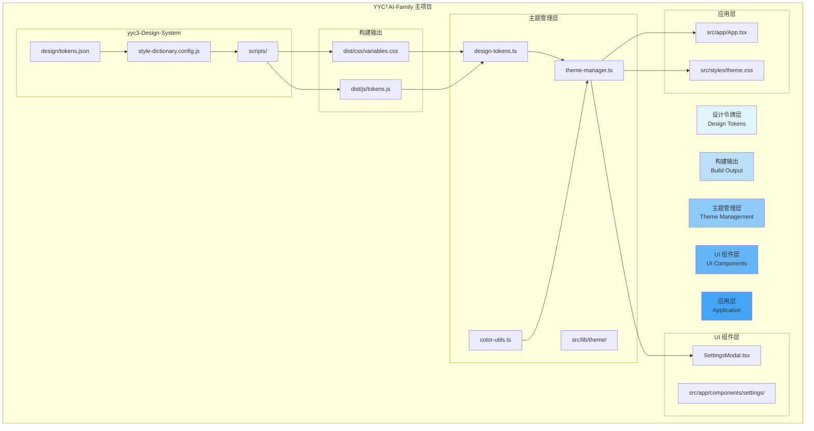
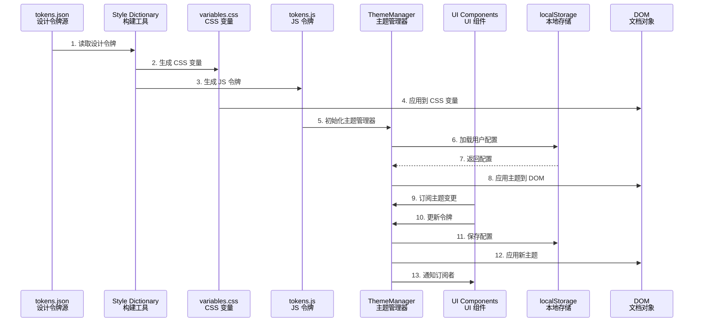
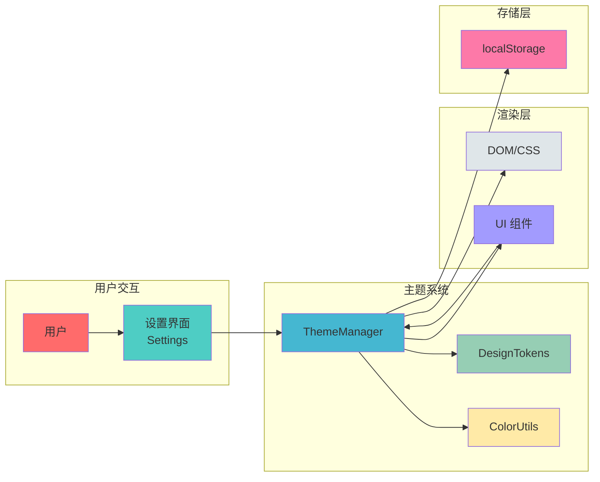

# YYC³ 设计系统集成方案

> **文档编号**: 250
> **文档类型**: 技术方案
> **创建日期**: 2026-02-18
> **状态**: 待实施

---

## 概述

本文档详细描述如何将 YYC³ Design System 集成到 YYC³ AI-Family 主项目中，实现设计令牌驱动的主题系统，支持 OKLch 颜色空间和自动化构建流程。

### 目标

1. **设计一致性**: 使用统一的设计令牌系统
2. **OKLch 支持**: 支持感知均匀的 OKLch 颜色空间
3. **自动化构建**: 集成 Style Dictionary 自动生成 CSS/JS 令牌
4. **向后兼容**: 不破坏现有主题设置功能
5. **可扩展性**: 支持多主题和自定义主题

---

## 架构设计

### 1. 系统架构



### 2. 数据流



### 3. 组件交互



### 4. 文件结构

```mermaid
graph TD
    Root[项目根目录]
    
    subgraph "设计系统"
        DS[yyc3-Design-System/]
        DT[design/tokens.json]
        SC[scripts/]
        DIST[dist/]
    end
    
    subgraph "主题管理"
        TM[src/lib/theme/]
        TYPES[types.ts]
        DTOKENS[design-tokens.ts]
        TMGR[theme-manager.ts]
        CUTILS[color-utils.ts]
        PRES[presets.ts]
    end
    
    subgraph "配置"
        CFG[style-dictionary.config.js]
        PKG[package.json]
    end
    
    subgraph "构建输出"
        PUBCSS[public/css/]
        GEN[generated-tokens.ts]
    end
    
    Root --> DS
    DS --> DT
    DS --> SC
    DS --> DIST
    Root --> TM
    TM --> TYPES
    TM --> DTOKENS
    TM --> TMGR
    TM --> CUTILS
    TM --> PRES
    Root --> CFG
    Root --> PKG
    Root --> PUBCSS
    Root --> GEN
    
    style Root fill:#2d3748
    style DS fill:#4a5568
    style TM fill:#4a5568
    style CFG fill:#4a5568
    style PUBCSS fill:#4a5568
    style DT fill:#718096
    style SC fill:#718096
    style DIST fill:#718096
    style TYPES fill:#a0aec0
    style DTOKENS fill:#a0aec0
    style TMGR fill:#a0aec0
    style CUTILS fill:#a0aec0
    style PRES fill:#a0aec0
    style CFG fill:#cbd5e0
    style PKG fill:#cbd5e0
    style PUBCSS fill:#cbd5e0
    style GEN fill:#cbd5e0
```



---

## 集成方案

### 方案选择：渐进式集成

**理由**：

1. 不破坏现有功能
2. 逐步增强主题系统
3. 保持用户体验一致性
4. 降低集成风险

### 阶段划分

#### 阶段 1：基础集成（第 1-2 周）

**目标**：建立设计令牌基础架构

**任务清单**：

- [ ] 复制 yyc3-Design-System 到主项目
- [ ] 配置 Style Dictionary 构建
- [ ] 创建设计令牌管理模块
- [ ] 集成 CSS 变量到主题系统
- [ ] 添加构建脚本到 package.json

**交付物**：

- `src/lib/theme/design-tokens.ts`
- `src/lib/theme/theme-manager.ts`
- `src/lib/theme/color-utils.ts`
- 更新的 `package.json`
- 构建脚本配置

**详细实施步骤**：

**步骤 1.1：复制设计系统到主项目**

```bash
# 1. 确认 yyc3-Design-System 目录存在
ls -la yyc3-Design-System/

# 2. 检查设计令牌文件
cat yyc3-Design-System/design/tokens.json

# 3. 确认构建输出目录
ls -la yyc3-Design-System/dist/

# 4. 复制必要的文件到主项目
# 注意：保持 yyc3-Design-System 作为独立目录
# 主项目通过导入使用生成的令牌文件
```

**步骤 1.2：配置 Style Dictionary 构建**

```bash
# 1. 安装 Style Dictionary 依赖
pnpm add -D style-dictionary

# 2. 创建构建脚本目录
mkdir -p scripts/tokens

# 3. 复制构建脚本
cp yyc3-Design-System/scripts/build-tokens.js scripts/tokens/
cp yyc3-Design-System/scripts/style-dictionary.transforms.js scripts/tokens/

# 4. 创建 Style Dictionary 配置
cat > style-dictionary.config.js << 'EOF'
const StyleDictionary = require('style-dictionary');
require('./scripts/tokens/style-dictionary.transforms');

module.exports = {
  source: ['yyc3-Design-System/design/tokens.json'],
  platforms: {
    css: {
      transformGroup: 'css',
      buildPath: 'public/css/',
      transforms: [
        'attribute/cti',
        'name/cti/kebab',
        'size/remToRem',
        'color/oklch-to-hex',
        'shadow/compose'
      ],
      files: [
        {
          destination: 'design-tokens.css',
          format: 'css/variables'
        }
      ]
    },
    js: {
      transformGroup: 'js',
      buildPath: 'src/lib/theme/',
      transforms: [
        'attribute/cti',
        'name/cti/camel',
        'color/oklch-to-hex',
        'shadow/compose'
      ],
      files: [
        {
          destination: 'generated-tokens.ts',
          format: 'javascript/es6'
        }
      ]
    }
  }
};
EOF

# 5. 测试构建
node -e "const sd = require('style-dictionary'); sd.extend(require('./style-dictionary.config.js')).buildAllPlatforms();"
```

**步骤 1.3：创建设计令牌管理模块**

```bash
# 1. 创建主题目录
mkdir -p src/lib/theme

# 2. 创建类型定义文件
cat > src/lib/theme/types.ts << 'EOF'
export interface DesignTokens {
  color: {
    primary: string;
    background: string;
    card: string;
    destructive: string;
    ring: string;
    foreground: string;
    mutedForeground: string;
  };
  radius: {
    default: string;
    sm: string;
    md: string;
    lg: string;
  };
  shadow: {
    card: string;
    popover: string;
    focus: string;
  };
  typography: {
    fontSans: string;
    fontSerif: string;
    fontMono: string;
  };
}

export interface ThemeConfig {
  tokens: DesignTokens;
  customOverrides: Partial<DesignTokens>;
  useOKLch: boolean;
}
EOF

# 3. 创建设计令牌文件
cat > src/lib/theme/design-tokens.ts << 'EOF'
import { DesignTokens } from './types';
import { tokens as yyc3Tokens } from './generated-tokens';

export const defaultTokens: DesignTokens = {
  color: {
    primary: yyc3Tokens.colorPrimary,
    background: yyc3Tokens.colorBackground,
    card: yyc3Tokens.colorCard,
    destructive: yyc3Tokens.colorDestructive,
    ring: yyc3Tokens.colorRing,
    foreground: yyc3Tokens.colorForeground,
    mutedForeground: yyc3Tokens.colorMutedForeground,
  },
  radius: {
    default: yyc3Tokens.radiusDefault,
    sm: yyc3Tokens.radiusSm,
    md: yyc3Tokens.radiusMd,
    lg: yyc3Tokens.radiusLg,
  },
  shadow: {
    card: yyc3Tokens.shadowCard,
    popover: yyc3Tokens.shadowPopover,
    focus: yyc3Tokens.shadowFocus,
  },
  typography: {
    fontSans: yyc3Tokens.typographyFontSans,
    fontSerif: yyc3Tokens.typographyFontSerif,
    fontMono: yyc3Tokens.typographyFontMono,
  },
};
EOF

# 4. 创建颜色工具文件
cat > src/lib/theme/color-utils.ts << 'EOF'
export function oklchToHex(oklch: string): string | null {
  // TODO: 实现 OKLch 到 HEX 转换
  return null;
}

export function hexToOklch(hex: string): { l: number; c: number; h: number } | null {
  // TODO: 实现 HEX 到 OKLch 转换
  return null;
}

export function calculateContrastRatio(foreground: string, background: string): number {
  // TODO: 实现对比度计算
  return 0;
}
EOF

# 5. 创建主题管理器文件
cat > src/lib/theme/theme-manager.ts << 'EOF'
import { DesignTokens, ThemeConfig, defaultTokens } from './types';
import { defaultTokens as tokens } from './design-tokens';

class ThemeManager {
  private static instance: ThemeManager;
  private config: ThemeConfig;
  private listeners: Set<() => void> = new Set();

  private constructor() {
    this.config = {
      tokens: { ...tokens },
      customOverrides: {},
      useOKLch: false,
    };
    this.loadFromStorage();
  }

  static getInstance(): ThemeManager {
    if (!ThemeManager.instance) {
      ThemeManager.instance = new ThemeManager();
    }
    return ThemeManager.instance;
  }

  private loadFromStorage() {
    try {
      const stored = localStorage.getItem('yyc3-theme-config');
      if (stored) {
        const parsed = JSON.parse(stored);
        this.config = {
          ...this.config,
          ...parsed,
          tokens: { ...tokens, ...parsed.customOverrides },
        };
      }
    } catch (e) {
      console.error('Failed to load theme config:', e);
    }
  }

  private saveToStorage() {
    try {
      localStorage.setItem('yyc3-theme-config', JSON.stringify(this.config));
    } catch (e) {
      console.error('Failed to save theme config:', e);
    }
  }

  applyTheme() {
    const root = document.documentElement;
    const { tokens } = this.config;

    root.style.setProperty('--color-primary', tokens.color.primary);
    root.style.setProperty('--color-background', tokens.color.background);
    root.style.setProperty('--color-card', tokens.color.card);
    root.style.setProperty('--color-destructive', tokens.color.destructive);
    root.style.setProperty('--color-ring', tokens.color.ring);
    root.style.setProperty('--color-foreground', tokens.color.foreground);
    root.style.setProperty('--color-muted-foreground', tokens.color.mutedForeground);

    root.style.setProperty('--radius-default', tokens.radius.default);
    root.style.setProperty('--radius-sm', tokens.radius.sm);
    root.style.setProperty('--radius-md', tokens.radius.md);
    root.style.setProperty('--radius-lg', tokens.radius.lg);

    root.style.setProperty('--shadow-card', tokens.shadow.card);
    root.style.setProperty('--shadow-popover', tokens.shadow.popover);
    root.style.setProperty('--shadow-focus', tokens.shadow.focus);

    root.style.setProperty('--font-sans', tokens.typography.fontSans);
    root.style.setProperty('--font-serif', tokens.typography.fontSerif);
    root.style.setProperty('--font-mono', tokens.typography.fontMono);
  }

  updateTokens(updates: Partial<DesignTokens>) {
    this.config.tokens = { ...this.config.tokens, ...updates };
    this.config.customOverrides = { ...this.config.customOverrides, ...updates };
    this.applyTheme();
    this.saveToStorage();
    this.notifyListeners();
  }

  getConfig(): ThemeConfig {
    return { ...this.config };
  }

  subscribe(listener: () => void) {
    this.listeners.add(listener);
    return () => this.listeners.delete(listener);
  }

  private notifyListeners() {
    this.listeners.forEach(listener => listener());
  }

  reset() {
    this.config = {
      tokens: { ...tokens },
      customOverrides: {},
      useOKLch: false,
    };
    this.applyTheme();
    this.saveToStorage();
    this.notifyListeners();
  }
}

export const themeManager = ThemeManager.getInstance();
EOF
```

**步骤 1.4：集成 CSS 变量到主题系统**

```bash
# 1. 在 index.html 中引入设计令牌 CSS
cat > public/css/design-tokens.css << 'EOF'
/**
 * YYC³ Design Tokens
 * Generated from yyc3-Design-System
 */
@import url('./design-tokens.css');
EOF

# 2. 在 index.html 中添加引用
# 在 <head> 标签中添加：
# <link rel="stylesheet" href="/css/design-tokens.css" />

# 3. 在 src/styles/theme.css 中添加引用
cat >> src/styles/theme.css << 'EOF'

/* YYC³ Design Tokens */
@import '../../public/css/design-tokens.css';
EOF
```

**步骤 1.5：添加构建脚本到 package.json**

```bash
# 1. 更新 package.json
# 添加以下脚本：
# "build:tokens": "node -e \"const sd = require('style-dictionary'); sd.extend(require('./style-dictionary.config.js')).buildAllPlatforms();\"",
# "watch:tokens": "chokidar 'yyc3-Design-System/design/**/*.json' -c 'pnpm run build:tokens'"

# 2. 测试构建脚本
pnpm run build:tokens

# 3. 验证输出文件
ls -la public/css/design-tokens.css
ls -la src/lib/theme/generated-tokens.ts
```

**步骤 1.6：验证集成**

```bash
# 1. 启动开发服务器
pnpm run dev

# 2. 打开浏览器开发者工具
# 3. 检查 CSS 变量是否正确应用
# 在 Console 中执行：
# getComputedStyle(document.documentElement).getPropertyValue('--color-primary')
# 应该返回: #d45a5f

# 4. 检查主题管理器是否正常工作
# 在 Console 中执行：
# import { themeManager } from './src/lib/theme/theme-manager';
# themeManager.applyTheme();
# 应该没有错误
```

**验证清单**：

- [ ] 设计令牌文件生成成功
- [ ] CSS 变量正确应用到页面
- [ ] 主题管理器正常工作
- [ ] localStorage 持久化正常
- [ ] 构建脚本执行成功
- [ ] 开发服务器正常启动

#### 阶段 2：OKLch 支持（第 3-4 周）

**目标**：添加 OKLch 颜色空间支持

**任务清单**：

- [ ] 安装颜色转换库（culori）
- [ ] 创建 OKLch ↔ HEX 转换工具
- [ ] 在强调色设置中添加 OKLch 模式
- [ ] 实现颜色对比度验证
- [ ] 添加颜色预览组件

**交付物**：

- `src/lib/theme/color-utils.ts` (完整实现)
- 更新的 `AppearanceSettings` 组件
- 颜色预览组件
- 颜色对比度测试

#### 阶段 3：主题预设（第 5-6 周）

**目标**：添加 YYC³ 官方主题预设

**任务清单**：

- [ ] 定义 YYC³ 官方主题
- [ ] 创建主题预设系统
- [ ] 实现主题导入/导出
- [ ] 添加主题版本管理
- [ ] 创建主题分享功能

**交付物**：

- `src/lib/theme/presets.ts`
- 主题管理 UI 组件
- 主题导入/导出功能
- 主题文档

#### 阶段 4：测试与优化（第 7-8 周）

**目标**：完善测试和性能优化

**任务清单**：

- [ ] 添加单元测试
- [ ] 添加集成测试
- [ ] 性能优化
- [ ] 可访问性验证
- [ ] 文档完善

**交付物**：

- 测试套件
- 性能报告
- 可访问性报告
- 完整文档

---

## 技术实现

### 1. 设计令牌管理

#### 文件结构

```
src/lib/theme/
├── design-tokens.ts          # 设计令牌定义
├── theme-manager.ts          # 主题管理器
├── color-utils.ts            # 颜色工具函数
├── presets.ts               # 主题预设
└── types.ts                 # 类型定义
```

#### design-tokens.ts

```typescript
import { tokens as yyc3Tokens } from '../../../yyc3-Design-System/dist/js/tokens';

export interface DesignTokens {
  color: {
    primary: string;
    background: string;
    card: string;
    destructive: string;
    ring: string;
    foreground: string;
    mutedForeground: string;
  };
  radius: {
    default: string;
    sm: string;
    md: string;
    lg: string;
  };
  shadow: {
    card: string;
    popover: string;
    focus: string;
  };
  typography: {
    fontSans: string;
    fontSerif: string;
    fontMono: string;
  };
}

export const defaultTokens: DesignTokens = {
  color: {
    primary: yyc3Tokens.colorPrimary,
    background: yyc3Tokens.colorBackground,
    card: yyc3Tokens.colorCard,
    destructive: yyc3Tokens.colorDestructive,
    ring: yyc3Tokens.colorRing,
    foreground: yyc3Tokens.colorForeground,
    mutedForeground: yyc3Tokens.colorMutedForeground,
  },
  radius: {
    default: yyc3Tokens.radiusDefault,
    sm: yyc3Tokens.radiusSm,
    md: yyc3Tokens.radiusMd,
    lg: yyc3Tokens.radiusLg,
  },
  shadow: {
    card: yyc3Tokens.shadowCard,
    popover: yyc3Tokens.shadowPopover,
    focus: yyc3Tokens.shadowFocus,
  },
  typography: {
    fontSans: yyc3Tokens.typographyFontSans,
    fontSerif: yyc3Tokens.typographyFontSerif,
    fontMono: yyc3Tokens.typographyFontMono,
  },
};
```

#### color-utils.ts

```typescript
import culori from 'culori';

export interface OKLchColor {
  l: number;
  c: number;
  h: number;
  a?: number;
}

export interface HEXColor {
  r: number;
  g: number;
  b: number;
  a?: number;
}

export function oklchToHex(oklch: string): string {
  try {
    const parsed = culori.parse(oklch);
    if (!parsed) return null;
    const srgb = culori.converter('srgb')(parsed);
    return culori.formatHex(srgb);
  } catch (e) {
    return null;
  }
}

export function hexToOklch(hex: string): OKLchColor {
  try {
    const parsed = culori.parse(hex);
    if (!parsed) return null;
    const oklch = culori.converter('oklch')(parsed);
    return {
      l: oklch.l,
      c: oklch.c,
      h: oklch.h,
      a: oklch.alpha,
    };
  } catch (e) {
    return null;
  }
}

export function formatOklch(oklch: OKLchColor): string {
  return `oklch(${oklch.l} ${oklch.c} ${oklch.h}${oklch.a ? ` / ${oklch.a}` : ''})`;
}

export function calculateContrastRatio(foreground: string, background: string): number {
  try {
    const fg = culori.parse(foreground);
    const bg = culori.parse(background);
    if (!fg || !bg) return 0;
    
    const fgLuminance = culori.luminance(fg);
    const bgLuminance = culori.luminance(bg);
    
    const lighter = Math.max(fgLuminance, bgLuminance);
    const darker = Math.min(fgLuminance, bgLuminance);
    
    return (lighter + 0.05) / (darker + 0.05);
  } catch (e) {
    return 0;
  }
}

export function isAccessible(foreground: string, background: string, level: 'AA' | 'AAA' = 'AA'): boolean {
  const ratio = calculateContrastRatio(foreground, background);
  return level === 'AA' ? ratio >= 4.5 : ratio >= 7;
}
```

#### theme-manager.ts

```typescript
import { DesignTokens, defaultTokens } from './design-tokens';

export interface ThemeConfig {
  tokens: DesignTokens;
  customOverrides: Partial<DesignTokens>;
  useOKLch: boolean;
}

class ThemeManager {
  private static instance: ThemeManager;
  private config: ThemeConfig;
  private listeners: Set<() => void> = new Set();

  private constructor() {
    this.config = {
      tokens: { ...defaultTokens },
      customOverrides: {},
      useOKLch: false,
    };
    this.loadFromStorage();
  }

  static getInstance(): ThemeManager {
    if (!ThemeManager.instance) {
      ThemeManager.instance = new ThemeManager();
    }
    return ThemeManager.instance;
  }

  private loadFromStorage() {
    try {
      const stored = localStorage.getItem('yyc3-theme-config');
      if (stored) {
        const parsed = JSON.parse(stored);
        this.config = {
          ...this.config,
          ...parsed,
          tokens: { ...defaultTokens, ...parsed.customOverrides },
        };
      }
    } catch (e) {
      console.error('Failed to load theme config:', e);
    }
  }

  private saveToStorage() {
    try {
      localStorage.setItem('yyc3-theme-config', JSON.stringify(this.config));
    } catch (e) {
      console.error('Failed to save theme config:', e);
    }
  }

  applyTheme() {
    const root = document.documentElement;
    const { tokens } = this.config;

    root.style.setProperty('--color-primary', tokens.color.primary);
    root.style.setProperty('--color-background', tokens.color.background);
    root.style.setProperty('--color-card', tokens.color.card);
    root.style.setProperty('--color-destructive', tokens.color.destructive);
    root.style.setProperty('--color-ring', tokens.color.ring);
    root.style.setProperty('--color-foreground', tokens.color.foreground);
    root.style.setProperty('--color-muted-foreground', tokens.color.mutedForeground);

    root.style.setProperty('--radius-default', tokens.radius.default);
    root.style.setProperty('--radius-sm', tokens.radius.sm);
    root.style.setProperty('--radius-md', tokens.radius.md);
    root.style.setProperty('--radius-lg', tokens.radius.lg);

    root.style.setProperty('--shadow-card', tokens.shadow.card);
    root.style.setProperty('--shadow-popover', tokens.shadow.popover);
    root.style.setProperty('--shadow-focus', tokens.shadow.focus);

    root.style.setProperty('--font-sans', tokens.typography.fontSans);
    root.style.setProperty('--font-serif', tokens.typography.fontSerif);
    root.style.setProperty('--font-mono', tokens.typography.fontMono);
  }

  updateTokens(updates: Partial<DesignTokens>) {
    this.config.tokens = { ...this.config.tokens, ...updates };
    this.config.customOverrides = { ...this.config.customOverrides, ...updates };
    this.applyTheme();
    this.saveToStorage();
    this.notifyListeners();
  }

  setUseOKLch(use: boolean) {
    this.config.useOKLch = use;
    this.saveToStorage();
    this.notifyListeners();
  }

  getConfig(): ThemeConfig {
    return { ...this.config };
  }

  subscribe(listener: () => void) {
    this.listeners.add(listener);
    return () => this.listeners.delete(listener);
  }

  private notifyListeners() {
    this.listeners.forEach(listener => listener());
  }

  reset() {
    this.config = {
      tokens: { ...defaultTokens },
      customOverrides: {},
      useOKLch: false,
    };
    this.applyTheme();
    this.saveToStorage();
    this.notifyListeners();
  }
}

export const themeManager = ThemeManager.getInstance();
```

### 2. 构建配置

#### package.json 更新

```json
{
  "scripts": {
    "build:tokens": "cd yyc3-Design-System && npm run build:tokens",
    "watch:tokens": "cd yyc3-Design-System && npm run watch:tokens",
    "test:oklch": "cd yyc3-Design-System && npm run test:oklch"
  },
  "devDependencies": {
    "culori": "^2.0.0"
  }
}
```

#### vite.config.ts 更新

```typescript
import { defineConfig } from 'vite';
import react from '@vitejs/plugin-react';

export default defineConfig({
  plugins: [react()],
  css: {
    postcss: './postcss.config.js',
  },
  build: {
    rollupOptions: {
      output: {
        assetFileNames: 'assets/[name]-[hash][extname]',
      },
    },
  },
});
```

### 3. 组件集成

#### 更新 AppearanceSettings 组件

```typescript
import { themeManager } from '@/lib/theme/theme-manager';
import { oklchToHex, hexToOklch, formatOklch, calculateContrastRatio, isAccessible } from '@/lib/theme/color-utils';

function AppearanceSettings({ t }: TranslationProps) {
  const [config, setConfig] = React.useState(themeManager.getConfig());
  const [useOKLch, setUseOKLch] = React.useState(config.useOKLch);

  React.useEffect(() => {
    const unsubscribe = themeManager.subscribe(() => {
      setConfig(themeManager.getConfig());
    });
    return unsubscribe;
  }, []);

  const handleAccentColorChange = (color: string) => {
    themeManager.updateTokens({
      color: {
        ...config.tokens.color,
        primary: color,
      },
    });
  };

  const handleOKLchChange = (oklch: string) => {
    const hex = oklchToHex(oklch);
    if (hex) {
      handleAccentColorChange(hex);
    }
  };

  return (
    <div className="space-y-8">
      {/* OKLch 模式切换 */}
      <div className="flex items-center justify-between p-4 rounded-lg border border-border bg-muted/10">
        <div>
          <div className="text-xs font-mono text-foreground">OKLch Color Mode</div>
          <div className="text-[10px] text-muted-foreground mt-0.5">Perceptually uniform color space</div>
        </div>
        <Switch checked={useOKLch} onCheckedChange={setUseOKLch} />
      </div>

      {/* 颜色选择器 */}
      {useOKLch ? (
        <OKLchColorPicker
          value={config.tokens.color.primary}
          onChange={handleOKLchChange}
        />
      ) : (
        <HEXColorPicker
          value={config.tokens.color.primary}
          onChange={handleAccentColorChange}
        />
      )}

      {/* 颜色对比度检查 */}
      <ColorContrastChecker
        foreground={config.tokens.color.primary}
        background={config.tokens.color.background}
      />
    </div>
  );
}
```

---

## 测试策略

### 1. 单元测试

```typescript
// src/lib/theme/__tests__/color-utils.test.ts
import { oklchToHex, hexToOklch, calculateContrastRatio, isAccessible } from '../color-utils';

describe('color-utils', () => {
  describe('oklchToHex', () => {
    it('should convert OKLch to HEX', () => {
      const hex = oklchToHex('oklch(0.6209 0.1801 348.1385)');
      expect(hex).toBe('#d45a5f');
    });

    it('should handle invalid input', () => {
      const hex = oklchToHex('invalid');
      expect(hex).toBeNull();
    });
  });

  describe('calculateContrastRatio', () => {
    it('should calculate contrast ratio', () => {
      const ratio = calculateContrastRatio('#ffffff', '#000000');
      expect(ratio).toBe(21);
    });
  });

  describe('isAccessible', () => {
    it('should check AA accessibility', () => {
      const accessible = isAccessible('#ffffff', '#000000', 'AA');
      expect(accessible).toBe(true);
    });
  });
});
```

### 2. 集成测试

```typescript
// src/lib/theme/__tests__/theme-manager.test.ts
import { themeManager } from '../theme-manager';

describe('theme-manager', () => {
  beforeEach(() => {
    themeManager.reset();
  });

  it('should apply default tokens', () => {
    themeManager.applyTheme();
    const root = document.documentElement;
    expect(root.style.getPropertyValue('--color-primary')).toBeTruthy();
  });

  it('should update tokens', () => {
    themeManager.updateTokens({
      color: {
        primary: '#ff0000',
      },
    });
    const config = themeManager.getConfig();
    expect(config.tokens.color.primary).toBe('#ff0000');
  });

  it('should persist to localStorage', () => {
    themeManager.updateTokens({
      color: {
        primary: '#ff0000',
      },
    });
    const stored = localStorage.getItem('yyc3-theme-config');
    expect(stored).toBeTruthy();
  });
});
```

---

## 部署流程

### 1. 开发环境

```bash
# 安装依赖
pnpm install

# 构建设计令牌
pnpm run build:tokens

# 启动开发服务器
pnpm run dev
```

### 2. 生产构建

```bash
# 构建设计令牌
pnpm run build:tokens

# 构建项目
pnpm run build
```

### 3. CI/CD 集成

```yaml
# .github/workflows/build.yml
name: Build

on:
  push:
    branches: [main]
  pull_request:
    branches: [main]

jobs:
  build:
    runs-on: ubuntu-latest
    steps:
      - uses: actions/checkout@v3
      - name: Setup Node.js
        uses: actions/setup-node@v3
        with:
          node-version: '18'
      - name: Install dependencies
        run: pnpm install
      - name: Build design tokens
        run: pnpm run build:tokens
      - name: Test OKLCH conversion
        run: pnpm run test:oklch
      - name: Build project
        run: pnpm run build
```

---

## 风险与缓解

### 风险 1：破坏现有功能

**缓解措施**：

- 采用渐进式集成
- 保持向后兼容
- 充分测试
- 灰度发布

### 风险 2：性能影响

**缓解措施**：

- 懒加载设计令牌
- 缓存转换结果
- 优化构建流程
- 性能监控

### 风险 3：浏览器兼容性

**缓解措施**：

- 提供 HEX 回退
- 检测浏览器支持
- 优雅降级
- 兼容性测试

---

## 用户使用指南

### 1. 快速开始

#### 1.1 启用设计令牌系统

设计令牌系统在集成后自动启用，无需额外配置。系统会自动：

1. 加载 YYC³ 默认设计令牌
2. 应用 CSS 变量到页面
3. 初始化主题管理器
4. 从 localStorage 加载用户自定义设置

#### 1.2 访问主题设置

1. 打开 YYC³ AI-Family 应用
2. 点击右上角设置图标（齿轮）
3. 在左侧导航栏中选择"外观主题"
4. 进入主题设置界面

### 2. 使用 OKLch 颜色模式

#### 2.1 切换到 OKLch 模式

1. 在"外观主题"设置中找到"OKLch Color Mode"开关
2. 打开开关启用 OKLch 模式
3. 颜色选择器将自动切换到 OKLch 模式

#### 2.2 使用 OKLch 颜色选择器

OKLch 颜色选择器提供三个滑块：

- **L (Lightness)**: 亮度 (0-100)
- **C (Chroma)**: 饱和度 (0-0.4)
- **H (Hue)**: 色相 (0-360)

**优势**：

- 感知均匀的颜色空间
- 更准确的视觉一致性
- 更好的颜色对比度控制

#### 2.3 颜色对比度检查

系统会自动检查颜色对比度：

- **AA 标准**: 对比度 ≥ 4.5:1（正文文本）
- **AAA 标准**: 对比度 ≥ 7:1（大标题文本）

如果颜色不符合标准，系统会显示警告提示。

### 3. 自定义主题

#### 3.1 修改强调色

1. 在"外观主题"设置中找到"Accent Color"部分
2. 从预设颜色中选择，或使用自定义颜色选择器
3. 颜色会立即应用到整个应用

**预设颜色**：

- Cyberpunk Blue (#0EA5E9)
- Neon Pink (#ec4899)
- Electric Purple (#8b5cf6)
- Matrix Green (#22c55e)
- Solar Orange (#f97316)

#### 3.2 调整背景

**背景颜色**：

1. 使用颜色选择器选择背景颜色
2. 或从预设颜色中选择
3. 背景会立即更新

**背景图片**：

1. 点击"上传背景图片"按钮
2. 选择本地图片文件（JPG/PNG/WebP）
3. 调整亮度和模糊效果
4. 预览效果

#### 3.3 调整透明度

**面板透明度**：

1. 找到"Opacity"部分
2. 拖动滑块调整面板透明度 (20%-100%)
3. 效果会实时预览

**覆盖层透明度**：

1. 找到"Overlay Opacity"部分
2. 拖动滑块调整覆盖层透明度 (30%-100%)
3. 影响所有二级页面和模态框

#### 3.4 自定义字体

**主字体**：

1. 找到"Font Family"部分
2. 点击"检测字体"按钮
3. 从下拉列表中选择字体
4. 预览字体效果

**等宽字体**：

1. 找到"Mono Font"部分
2. 从下拉列表中选择等宽字体
3. 用于代码和终端显示

**字体大小**：

1. 找到"Font Size"部分
2. 拖动滑块调整字体大小 (10px-20px)
3. 默认为 14px

### 4. 视觉效果

#### 4.1 启用/禁用效果

在"Visual Effects"部分可以控制：

- **背景模糊**: 为面板和覆盖层添加背景模糊
- **扫描线**: 添加 CRT 风格的扫描线效果
- **发光效果**: 为主要元素添加霓虹发光效果

#### 4.2 边框和阴影

**边框颜色**：

1. 找到"Border / Shadow"部分
2. 使用颜色选择器选择边框颜色
3. 从预设中选择快速应用

**阴影颜色**：

1. 使用颜色选择器选择阴影颜色
2. 调整阴影强度滑块 (0%-100%)
3. 预览阴影效果

**发光颜色**：

1. 使用颜色选择器选择发光颜色
2. 发光效果会应用到主要文本和按钮

### 5. 主题预览

#### 5.1 实时预览

主题设置页面底部提供实时预览：

- 显示当前主题配置的综合效果
- 包括所有主要 UI 元素
- 实时响应设置更改

#### 5.2 应用主题

所有更改会自动应用，无需手动保存。系统会：

1. 实时更新 CSS 变量
2. 保存配置到 localStorage
3. 通知所有订阅的组件

### 6. 重置主题

#### 6.1 重置到默认

1. 在主题设置页面底部找到"RESET TO DEFAULT"按钮
2. 点击按钮确认重置
3. 所有自定义设置将被清除
4. 恢复 YYC³ 默认主题

**注意**：此操作不可撤销，请谨慎操作。

### 7. 高级功能

#### 7.1 主题预设（阶段 3）

集成完成后，系统将支持主题预设：

1. 在主题设置中选择"主题预设"标签
2. 从 YYC³ 官方主题中选择
3. 一键应用完整主题配置

**官方主题**：

- YYC³ Default
- Cyberpunk Dark
- Neon Light
- Matrix Green
- Solar Orange

#### 7.2 主题导入/导出（阶段 3）

**导出主题**：

1. 在主题设置中点击"导出主题"按钮
2. 选择导出格式（JSON/YAML）
3. 下载主题配置文件

**导入主题**：

1. 点击"导入主题"按钮
2. 选择主题配置文件
3. 系统会验证并应用主题

#### 7.3 主题分享（阶段 3）

1. 导出主题配置
2. 分享主题文件或代码
3. 其他用户可以导入使用

### 8. 键盘快捷键

| 快捷键 | 功能 |
|---------|------|
| `Cmd/Ctrl + ,` | 打开设置 |
| `Cmd/Ctrl + Shift + T` | 切换主题 |
| `Cmd/Ctrl + Shift + D` | 切换深色/浅色模式 |
| `Esc` | 关闭设置面板 |

### 9. 最佳实践

#### 9.1 颜色选择

- 使用 OKLch 模式获得更好的视觉一致性
- 确保文本对比度符合 WCAG AA 标准
- 避免使用过于相似的颜色
- 考虑色盲用户的可访问性

#### 9.2 性能优化

- 避免频繁切换主题
- 使用预设主题而非完全自定义
- 关闭不必要的视觉效果（如扫描线）
- 定期清理 localStorage

#### 9.3 可访问性

- 确保文本对比度 ≥ 4.5:1
- 使用语义化颜色而非仅依赖颜色
- 测试键盘导航
- 验证屏幕阅读器兼容性

### 10. 常见问题

#### Q1: 为什么我的颜色更改没有生效？

**A**: 请检查：

1. 是否启用了 OKLch 模式
2. 浏览器是否支持 CSS 变量
3. 是否有其他样式覆盖
4. 尝试刷新页面

#### Q2: OKLch 模式不工作？

**A**: OKLch 需要：

1. 现代浏览器支持（Chrome 111+, Firefox 113+, Safari 15.4+）
2. 正确的颜色转换库
3. 有效的 OKLch 值

#### Q3: 如何恢复默认主题？

**A**:

1. 打开主题设置
2. 滚动到底部
3. 点击"RESET TO DEFAULT"按钮
4. 确认重置

#### Q4: 主题设置会同步到其他设备吗？

**A**: 目前不会。主题设置存储在本地 localStorage 中。未来版本将支持云端同步。

#### Q5: 如何分享我的主题？

**A**:

1. 导出主题配置（阶段 3 功能）
2. 分享主题文件
3. 其他用户可以导入使用

---

## 后续计划

### 短期（1-2 个月）

- [ ] 完成阶段 1-3 的实施
- [ ] 添加主题预设
- [ ] 完善测试覆盖
- [ ] 编写用户文档

### 中期（3-6 个月）

- [ ] 添加主题市场
- [ ] 实现主题同步
- [ ] 添加 AI 主题推荐
- [ ] 优化性能

### 长期（6-12 个月）

- [ ] 支持更多颜色空间
- [ ] 添加主题编辑器
- [ ] 实现主题协作
- [ ] 建立主题生态

---

## 故障排除指南

### 1. 构建问题

#### 问题 1.1：Style Dictionary 构建失败

**症状**：

- 运行 `pnpm run build:tokens` 时报错
- 错误信息：`Cannot find module 'style-dictionary'`

**解决方案**：

```bash
# 1. 确认依赖已安装
pnpm list style-dictionary

# 2. 重新安装依赖
pnpm install

# 3. 清理缓存
pnpm store prune

# 4. 重新构建
pnpm run build:tokens
```

**预防措施**：

- 确保 `package.json` 中包含 `style-dictionary` 依赖
- 使用正确的 Node.js 版本（≥ 16.0.0）

#### 问题 1.2：设计令牌文件未生成

**症状**：

- 运行构建后，输出目录为空
- CSS/JS 令牌文件不存在

**解决方案**：

```bash
# 1. 检查源文件是否存在
ls -la yyc3-Design-System/design/tokens.json

# 2. 检查配置文件
cat style-dictionary.config.js

# 3. 手动运行构建
node -e "const sd = require('style-dictionary'); sd.extend(require('./style-dictionary.config.js')).buildAllPlatforms();"

# 4. 检查输出目录
ls -la public/css/
ls -la src/lib/theme/
```

**预防措施**：

- 确保 `style-dictionary.config.js` 中的路径正确
- 检查文件权限

### 2. 运行时问题

#### 问题 2.1：CSS 变量未应用

**症状**：

- 页面样式不正确
- CSS 变量返回空值

**解决方案**：

```javascript
// 1. 检查 CSS 变量是否定义
const root = document.documentElement;
const primaryColor = getComputedStyle(root).getPropertyValue('--color-primary');
console.log('Primary color:', primaryColor);

// 2. 手动应用主题
import { themeManager } from '@/lib/theme/theme-manager';
themeManager.applyTheme();

// 3. 检查 CSS 文件是否加载
// 在浏览器开发者工具中检查 Network 标签
// 确认 design-tokens.css 已加载
```

**预防措施**：

- 确保 `index.html` 中正确引用 CSS 文件
- 检查 CSS 文件路径

#### 问题 2.2：主题切换不生效

**症状**：

- 更改主题设置后样式未更新
- 需要刷新页面才能看到更改

**解决方案**：

```javascript
// 1. 检查主题管理器是否正确初始化
import { themeManager } from '@/lib/theme/theme-manager';

// 2. 确保组件订阅了主题变更
React.useEffect(() => {
  const unsubscribe = themeManager.subscribe(() => {
    // 主题变更时的处理逻辑
  });
  return unsubscribe;
}, []);

// 3. 手动触发主题更新
themeManager.applyTheme();
```

**预防措施**：

- 确保所有需要响应主题的组件都订阅了主题变更
- 使用 React Context 或状态管理库

### 3. OKLch 问题

#### 问题 3.1：OKLch 颜色转换失败

**症状**：

- OKLch 颜色显示为黑色或白色
- 颜色选择器返回错误

**解决方案**：

```javascript
// 1. 检查浏览器支持
const supportsOKLch = CSS.supports('color', 'oklch');
console.log('OKLch support:', supportsOKLch);

// 2. 检查颜色转换库
import { oklchToHex } from '@/lib/theme/color-utils';

const oklch = 'oklch(0.6209 0.1801 348.1385)';
const hex = oklchToHex(oklch);
console.log('Converted hex:', hex);

// 3. 使用 HEX 回退
if (!hex) {
  console.warn('OKLch conversion failed, using fallback');
  // 使用预设的 HEX 值
}
```

**预防措施**：

- 提供有效的 OKLch 值
- 实现颜色转换错误处理
- 提供 HEX 回退选项

#### 问题 3.2：颜色对比度计算错误

**症状**：

- 对比度检查显示错误值
- 可访问性警告不准确

**解决方案**：

```javascript
// 1. 验证颜色格式
import { calculateContrastRatio, isAccessible } from '@/lib/theme/color-utils';

const foreground = '#ffffff';
const background = '#000000';

// 2. 检查颜色是否有效
const ratio = calculateContrastRatio(foreground, background);
console.log('Contrast ratio:', ratio);

// 3. 验证可访问性
const isAA = isAccessible(foreground, background, 'AA');
const isAAA = isAccessible(foreground, background, 'AAA');
console.log('AA accessible:', isAA, 'AAA accessible:', isAAA);
```

**预防措施**：

- 使用有效的颜色值
- 验证颜色格式（HEX、RGB、OKLch）
- 测试不同颜色组合

### 4. 性能问题

#### 问题 4.1：主题切换卡顿

**症状**：

- 切换主题时页面卡顿
- 动画不流畅

**解决方案**：

```javascript
// 1. 使用 CSS 变量而非直接样式
// 好的做法
root.style.setProperty('--color-primary', newColor);

// 不好的做法
document.querySelectorAll('.button').forEach(btn => {
  btn.style.color = newColor;
});

// 2. 使用 requestAnimationFrame 优化
function updateTheme() {
  requestAnimationFrame(() => {
    themeManager.applyTheme();
  });
}

// 3. 批量更新 CSS 变量
const updates = {
  '--color-primary': newColor,
  '--color-background': newBgColor,
  '--color-card': newCardColor,
};

Object.entries(updates).forEach(([key, value]) => {
  root.style.setProperty(key, value);
});
```

**预防措施**：

- 使用 CSS 变量而非直接样式
- 批量更新而非逐个更新
- 使用 requestAnimationFrame 优化动画

#### 问题 4.2：localStorage 超限

**症状**：

- 主题设置无法保存
- 控制台显示 localStorage 错误

**解决方案**：

```javascript
// 1. 检查 localStorage 可用性
try {
  localStorage.setItem('test', 'test');
  localStorage.removeItem('test');
  console.log('localStorage is available');
} catch (e) {
  console.error('localStorage is not available:', e);
  // 使用替代存储方案
}

// 2. 压缩主题配置
function compressThemeConfig(config) {
  // 只保存必要的字段
  return {
    tokens: config.tokens,
    useOKLch: config.useOKLch,
  };
}

// 3. 清理旧数据
function cleanupOldThemeData() {
  const keys = Object.keys(localStorage);
  keys.forEach(key => {
    if (key.startsWith('yyc3-theme-') && key !== 'yyc3-theme-config') {
      localStorage.removeItem(key);
    }
  });
}
```

**预防措施**：

- 压缩主题配置数据
- 定期清理旧数据
- 使用 IndexedDB 作为替代方案

### 5. 浏览器兼容性问题

#### 问题 5.1：旧浏览器不支持 CSS 变量

**症状**：

- 旧浏览器中样式不正确
- CSS 变量未生效

**解决方案**：

```css
/* 1. 提供回退样式 */
.button {
  /* 现代浏览器 */
  background: var(--color-primary, #0EA5E9);
  
  /* 旧浏览器回退 */
  background: #0EA5E9;
}

/* 2. 使用 @supports 检测 */
@supports (--css: variables) {
  .button {
    background: var(--color-primary);
  }
}

/* 3. 使用 PostCSS 插件自动添加回退 */
/* 配置 postcss-custom-properties 插件 */
```

**预防措施**：

- 提供回退样式
- 使用 `@supports` 检测
- 配置 PostCSS 插件

#### 问题 5.2：OKLch 不被支持

**症状**：

- OKLch 颜色显示为默认值
- 浏览器不支持 OKLch

**解决方案**：

```javascript
// 1. 检测浏览器支持
const supportsOKLch = CSS.supports('color', 'oklch');

if (!supportsOKLch) {
  console.warn('OKLch not supported, using HEX fallback');
  // 自动切换到 HEX 模式
  themeManager.setUseOKLch(false);
}

// 2. 在 UI 中显示警告
if (!supportsOKLch && useOKLch) {
  return (
    <div className="warning-banner">
      您的浏览器不支持 OKLch 颜色空间，
      已自动切换到 HEX 模式。
    </div>
  );
}
```

**预防措施**：

- 检测浏览器支持
- 提供自动回退
- 显示用户友好的警告

### 6. 开发环境问题

#### 问题 6.1：热重载不工作

**症状**：

- 修改设计令牌后页面不更新
- 需要手动刷新

**解决方案**：

```bash
# 1. 确认文件监听已配置
cat package.json | grep watch:tokens

# 2. 检查 chokidar 依赖
pnpm list chokidar

# 3. 手动启动监听
pnpm run watch:tokens

# 4. 在另一个终端启动开发服务器
pnpm run dev
```

**预防措施**：

- 确保文件监听正确配置
- 使用可靠的文件监听库（chokidar）
- 分离令牌构建和开发服务器

#### 问题 6.2：TypeScript 类型错误

**症状**：

- TypeScript 编译失败
- 类型不匹配错误

**解决方案**：

```typescript
// 1. 确保类型定义正确
import type { DesignTokens, ThemeConfig } from '@/lib/theme/types';

// 2. 使用类型断言（如需要）
const config = themeManager.getConfig() as ThemeConfig;

// 3. 检查生成的令牌类型
import { tokens } from '@/lib/theme/generated-tokens';

// 确保 tokens 的类型与 DesignTokens 匹配
```

**预防措施**：

- 确保类型定义完整
- 使用类型断言（谨慎使用）
- 定期运行类型检查

### 7. 调试技巧

#### 7.1：启用调试模式

```javascript
// 1. 在主题管理器中添加调试日志
class ThemeManager {
  private debug = true;

  private log(message: string, data?: any) {
    if (this.debug) {
      console.log(`[ThemeManager] ${message}`, data);
    }
  }

  applyTheme() {
    this.log('Applying theme', this.config);
    // ...
  }
}
```

#### 7.2：检查 CSS 变量

```javascript
// 在浏览器控制台中执行
const root = document.documentElement;
const computedStyle = getComputedStyle(root);

// 列出所有 CSS 变量
for (let i = 0; i < computedStyle.length; i++) {
  const property = computedStyle[i];
  if (property.startsWith('--')) {
    console.log(`${property}: ${computedStyle.getPropertyValue(property)}`);
  }
}
```

#### 7.3：监控主题变更

```javascript
// 订阅主题变更并记录
import { themeManager } from '@/lib/theme/theme-manager';

themeManager.subscribe(() => {
  console.log('Theme changed:', themeManager.getConfig());
});
```

### 8. 获取帮助

如果以上解决方案无法解决问题：

1. **查看文档**
   - [YYC³ Design System 文档](../yyc3-Design-System/README.md)
   - [Style Dictionary 文档](https://amzn.github.io/style-dictionary/)
   - [OKLch 规范](https://www.w3.org/TR/css-color-4/#funcdef-oklch)

2. **检查浏览器兼容性**
   - [Can I Use - CSS Variables](https://caniuse.com/css-variables)
   - [Can I Use - OKLch](https://caniuse.com/css-color-oklab)

3. **提交问题**
   - [GitHub Issues](https://github.com/yyc3/yyc3-ai-family/issues)
   - 提供详细的错误信息和复现步骤

4. **联系支持**
   - Email: [admin@0379.email](mailto:admin@0379.email)
   - 提供系统信息和错误日志

---

## 参考资料

- [YYC³ Design System](../yyc3-Design-System/README.md)
- [Style Documentation](https://amzn.github.io/style-dictionary/)
- [OKLch Specification](https://www.w3.org/TR/css-color-4/#funcdef-oklch)
- [Culori Documentation](https://culorijs.org/)
- [Web Content Accessibility Guidelines](https://www.w3.org/WAI/WCAG21/quickref/)

---

<div align="center">

> 「***YanYuCloudCube***」
> 「***<admin@0379.email>***」
> 「***Words Initiate Quadrants, Language Serves as Core for the Future***」
> 「***All things converge in the cloud pivot; Deep stacks ignite a new era of intelligence***」

*文档最后更新：2026-02-18*

</div>
