# YYC³ AI-Family - 数据库同步智能执行方案

> **执行级别**: 🔴 **P0 - 智能自动化**
>
> **核心理念**: 审核前置 + 智能同步 + 自动化验证
>
> **执行频率**: 每次涉及数据库操作前必须执行

---

## 📊 执行概览

| 执行阶段 | 审核要求 | 自动化程度 | 智能验证 |
|---------|---------|-----------|-----------|
| **阶段1: 预检** | P0强制 | 90%自动化 | 实时验证 |
| **阶段2: 同步** | P0强制 | 95%自动化 | 智能路由 |
| **阶段3: 验证** | P0强制 | 100%自动化 | 自动测试 |
| **阶段4: 回滚** | P0强制 | 100%自动化 | 一键回退 |
| **阶段5: 监控** | P1重要 | 100%自动化 | 实时告警 |

---

## 🎯 执行流程总览

```mermaid
graph TB
    A[开始数据库同步] --> B[阶段1: 预检审核]
    B --> C{是否通过?}
    C -->|是| D[阶段2: 智能同步]
    C -->|否| E[修复问题]
    E --> B
    D --> F[阶段3: 自动验证]
    F --> G{验证通过?}
    G -->|是| H[阶段4: 监控部署]
    G -->|否| I[阶段5: 智能回滚]
    I --> D
    H --> J[完成]

    style A fill:#0EA5E9
    style B fill:#10B981
    style C fill:#F59E0B
    style D fill:#3B82F6
    style E fill:#EF4444
    style F fill:#10B981
    style G fill:#F59E0B
    style H fill:#10B981
    style I fill:#EF4444
    style J fill:#22C55E
```



---

## 📋 阶段1: 预检审核（P0强制）

### 1.1 代码质量预检

#### 自动化检查（90%）

```bash
#!/bin/bash
# scripts/db-sync-precheck.sh

echo "🔍 开始数据库同步预检..."

# 1. 提交前审核清单检查
echo "📋 检查提交前审核清单..."
bash scripts/pre-commit-check.sh || exit 1

# 2. TypeScript类型检查
echo "🔍 TypeScript类型检查..."
pnpm run type-check || exit 1

# 3. 数据库相关代码审查
echo "🗄️ 检查数据库相关代码..."
if git diff --name-only | grep -q "src/lib/\(db\|sql\|store\)"; then
  echo "⚠️  检测到数据库相关代码变更"
  echo "📝 需要额外审核："
  echo "  - SQL注入防护"
  echo "  - 参数化查询"
  echo "  - 事务管理"
  echo "  - 错误处理"
fi

# 4. 依赖安全扫描
echo "🔒 安全扫描..."
npm audit --production || exit 1

echo "✅ 预检审核通过！"
```

#### 人工审核项（10%）

- [ ] **SQL查询审查**: 所有新增/修改的SQL语句必须人工审查
- [ ] **数据迁移检查**: 新增迁移脚本必须有回滚方案
- [ ] **索引优化**: 检查是否需要新增/删除索引
- [ ] **性能影响**: 评估查询性能影响

### 1.2 数据库连接配置验证

#### 连接池配置检查

```typescript
// 检查文件: src/lib/db-config.ts

export const DB_CONFIG = {
  host: process.env.DB_HOST || 'localhost',
  port: parseInt(process.env.DB_PORT || '5433'),
  database: process.env.DB_NAME || 'yyc3_aify',
  user: process.env.DB_USER || 'yyc3_dev',
  password: process.env.DB_PASSWORD,
  max: 20,              // 最大连接数
  min: 5,               // 最小连接数
  idle: 10000,           // 空闲超时(ms)
  acquire: 30000,         // 获取超时(ms)
};
```

**验证清单**:

- [ ] **连接池配置合理**: max/min/idle/acquire参数合理
- [ ] **环境变量完整**: DB_HOST, DB_PORT, DB_NAME, DB_USER, DB_PASSWORD都已配置
- [ ] **默认值正确**: 本地开发使用localhost:5433
- [ ] **超时设置合理**: 避免连接超时

#### 数据库健康检查

```bash
# 验证数据库可连接性
#!/bin/bash
# scripts/db-health-check.sh

DB_HOST=${DB_HOST:-localhost}
DB_PORT=${DB_PORT:-5433}
DB_NAME=${DB_NAME:-yyc3_aify}
DB_USER=${DB_USER:-yyc3_dev}
DB_PASSWORD=${DB_PASSWORD}

echo "🏥 检查数据库健康状态..."
PGPASSWORD=$DB_PASSWORD psql -h $DB_HOST -p $DB_PORT -U $DB_USER -d $DB_NAME -c "
  SELECT
    COUNT(*) as total_tables,
    pg_size_pretty(pg_database_size('$DB_NAME')) as db_size
  FROM information_schema.tables
  WHERE table_schema = 'public';
"

if [ $? -eq 0 ]; then
  echo "✅ 数据库健康状态正常"
else
  echo "❌ 数据库连接失败"
  exit 1
fi
```

---

## 📋 阶段2: 智能同步（P0强制）

### 2.1 数据库连接池管理

#### 智能连接池实现

```typescript
// src/lib/db-pool.ts

import pg from 'pg';

export class DBPoolManager {
  private pool: pg.Pool | null = null;
  private connectionConfig: any;

  constructor(config: any) {
    this.connectionConfig = config;
  }

  async initialize(): Promise<void> {
    if (this.pool) {
      console.log('⚠️  连接池已存在，跳过初始化');
      return;
    }

    this.pool = new pg.Pool(this.connectionConfig);

    // 监听连接事件
    this.pool.on('connect', () => {
      console.log('✅ 数据库连接已建立');
    });

    this.pool.on('error', (err) => {
      console.error('❌ 数据库连接错误:', err);
    });

    this.pool.on('remove', () => {
      console.log('📤 数据库连接已释放');
    });

    // 健康检查
    await this.healthCheck();
  }

  async healthCheck(): Promise<boolean> {
    if (!this.pool) return false;

    try {
      const client = await this.pool.connect();
      await client.query('SELECT NOW()');
      client.release();
      return true;
    } catch (error) {
      console.error('❌ 数据库健康检查失败:', error);
      return false;
    }
  }

  async executeQuery<T>(
    query: string,
    params: any[] = []
  ): Promise<pg.QueryResult<T>> {
    if (!this.pool) {
      throw new Error('数据库连接池未初始化');
    }

    // 参数化查询防护
    const sanitizedQuery = this.sanitizeQuery(query);

    // 执行查询
    const result = await this.pool.query(sanitizedQuery, params);

    // 记录查询性能
    this.logQueryPerformance(query, result);

    return result;
  }

  async executeTransaction<T>(
    callback: (client: pg.PoolClient) => Promise<T>
  ): Promise<T> {
    if (!this.pool) {
      throw new Error('数据库连接池未初始化');
    }

    const client = await this.pool.connect();
    try {
      await client.query('BEGIN');
      const result = await callback(client);
      await client.query('COMMIT');
      return result;
    } catch (error) {
      await client.query('ROLLBACK');
      throw error;
    } finally {
      client.release();
    }
  }

  private sanitizeQuery(query: string): string {
    // SQL注入防护
    // 注意：实际应使用参数化查询，这里仅作示例
    return query;
  }

  private logQueryPerformance(query: string, result: pg.QueryResult): void {
    const duration = result.rowCount; // 实际应使用真实耗时
    if (duration > 1000) {
      console.warn(`⚠️  慢查询 (${duration}ms):`, query.substring(0, 100));
    }
  }

  async close(): Promise<void> {
    if (this.pool) {
      await this.pool.end();
      this.pool = null;
      console.log('🔌 数据库连接池已关闭');
    }
  }
}

export const dbPool = new DBPoolManager({
  host: process.env.DB_HOST || 'localhost',
  port: parseInt(process.env.DB_PORT || '5433'),
  database: process.env.DB_NAME || 'yyc3_aify',
  user: process.env.DB_USER || 'yyc3_dev',
  password: process.env.DB_PASSWORD,
  max: 20,
  min: 5,
  idle: 10000,
  acquire: 30000,
});
```

### 2.2 智能数据迁移

#### 迁移版本管理

```typescript
// src/lib/db-migration.ts

export interface Migration {
  version: string;
  name: string;
  up: string;    // SQL升级脚本
  down: string;  // SQL回滚脚本
  checksum: string; // 校验和
}

export class MigrationManager {
  private migrations: Migration[] = [];

  async initialize(): Promise<void> {
    // 创建迁移记录表
    await this.createMigrationTable();

    // 加载已执行的迁移
    const executedMigrations = await this.getExecutedMigrations();

    // 筛选待执行的迁移
    const pendingMigrations = this.migrations.filter(
      m => !executedMigrations.find(e => e.version === m.version)
    );

    if (pendingMigrations.length > 0) {
      console.log(`📋 发现 ${pendingMigrations.length} 个待执行的迁移`);
      await this.executeMigrations(pendingMigrations);
    } else {
      console.log('✅ 所有迁移已是最新的');
    }
  }

  async executeMigrations(migrations: Migration[]): Promise<void> {
    for (const migration of migrations) {
      console.log(`🔄 执行迁移: ${migration.name} (${migration.version})`);

      // 验证校验和
      const expectedChecksum = this.calculateChecksum(migration.up);
      if (migration.checksum !== expectedChecksum) {
        throw new Error(`迁移校验失败: ${migration.name}`);
      }

      // 执行事务
      await dbPool.executeTransaction(async (client) => {
        // 记录迁移开始
        await client.query(
          'INSERT INTO migrations (version, name, checksum, status, started_at) VALUES ($1, $2, $3, $4, NOW())',
          [migration.version, migration.name, migration.checksum, 'running']
        );

        // 执行升级脚本
        await client.query(migration.up);

        // 更新迁移状态为完成
        await client.query(
          'UPDATE migrations SET status = $1, completed_at = NOW() WHERE version = $2',
          ['completed', migration.version]
        );
      });

      console.log(`✅ 迁移完成: ${migration.name}`);
    }
  }

  async rollback(version: string): Promise<void> {
    const migration = this.migrations.find(m => m.version === version);
    if (!migration) {
      throw new Error(`未找到迁移: ${version}`);
    }

    console.log(`🔄 回滚迁移: ${migration.name} (${migration.version})`);

    await dbPool.executeTransaction(async (client) => {
      // 执行回滚脚本
      await client.query(migration.down);

      // 删除迁移记录
      await client.query(
        'DELETE FROM migrations WHERE version = $1',
        [version]
      );
    });

    console.log(`✅ 回滚完成: ${migration.name}`);
  }

  private createMigrationTable(): Promise<void> {
    await dbPool.executeQuery(`
      CREATE TABLE IF NOT EXISTS migrations (
        id SERIAL PRIMARY KEY,
        version VARCHAR(50) UNIQUE NOT NULL,
        name VARCHAR(255) NOT NULL,
        checksum VARCHAR(64) NOT NULL,
        status VARCHAR(20) NOT NULL,
        started_at TIMESTAMP,
        completed_at TIMESTAMP
      );
    `);
  }

  private async getExecutedMigrations(): Promise<string[]> {
    const result = await dbPool.executeQuery(`
      SELECT version FROM migrations WHERE status = 'completed' ORDER BY version ASC
    `);
    return result.rows.map(row => row.version);
  }

  private calculateChecksum(sql: string): string {
    const crypto = require('crypto');
    return crypto.createHash('sha256').update(sql).digest('hex');
  }
}
```

### 2.3 智能缓存策略

#### Redis缓存管理

```typescript
// src/lib/cache-manager.ts

import { createClient } from 'redis';

export class CacheManager {
  private client: any;

  constructor() {
    this.client = createClient({
      host: process.env.REDIS_HOST || 'localhost',
      port: parseInt(process.env.REDIS_PORT || '6379'),
      password: process.env.REDIS_PASSWORD,
    });

    this.client.on('error', (err) => {
      console.error('❌ Redis连接错误:', err);
    });

    this.client.on('connect', () => {
      console.log('✅ Redis连接已建立');
    });
  }

  async initialize(): Promise<void> {
    await this.client.connect();
  }

  async get<T>(key: string): Promise<T | null> {
    const data = await this.client.get(`yyc3:${key}`);
    if (!data) return null;

    return JSON.parse(data);
  }

  async set(key: string, value: any, ttl: number = 3600): Promise<void> {
    await this.client.setEx(`yyc3:${key}`, JSON.stringify(value), ttl);
  }

  async delete(key: string): Promise<void> {
    await this.client.del(`yyc3:${key}`);
  }

  async invalidatePattern(pattern: string): Promise<void> {
    const keys = await this.client.keys(`yyc3:${pattern}`);
    if (keys.length > 0) {
      await this.client.del(keys);
      console.log(`🗑️  清理缓存: ${keys.length} 个key`);
    }
  }

  async getHealth(): Promise<{ status: string; keys: number; memory: string }> {
    const info = await this.client.info('stats');
    return {
      status: this.client.status === 'ready' ? 'healthy' : 'unhealthy',
      keys: parseInt(info.keyspace_count || '0'),
      memory: info.used_memory_human || 'N/A',
    };
  }

  async close(): Promise<void> {
    await this.client.quit();
    console.log('🔌 Redis连接已关闭');
  }
}

export const cacheManager = new CacheManager();
```

---

## 📋 阶段3: 自动验证（P0强制）

### 3.1 数据完整性验证

```typescript
// src/lib/db-validator.ts

export class DatabaseValidator {
  async validateTables(): Promise<{
    valid: boolean;
    issues: string[];
  }> {
    const issues: string[] = [];

    // 检查核心表是否存在
    const requiredTables = [
      'users',
      'agents',
      'conversations',
      'messages',
      'provider_configs',
      'settings',
    ];

    for (const table of requiredTables) {
      const result = await dbPool.executeQuery(`
        SELECT EXISTS (
          SELECT FROM information_schema.tables
          WHERE table_schema = 'public'
          AND table_name = $1
        );
      `, [table]);

      if (!result.rows[0].exists) {
        issues.push(`缺少必需表: ${table}`);
      }
    }

    return {
      valid: issues.length === 0,
      issues,
    };
  }

  async validateIndexes(): Promise<{
    valid: boolean;
    issues: string[];
  }> {
    const issues: string[] = [];

    // 检查关键表是否有索引
    const indexedTables = ['messages', 'conversations', 'agents'];

    for (const table of indexedTables) {
      const result = await dbPool.executeQuery(`
        SELECT COUNT(*) as index_count
        FROM pg_indexes
        WHERE tablename = $1
      `, [table]);

      if (result.rows[0].index_count === 0) {
        issues.push(`表 ${table} 缺少索引`);
      }
    }

    return {
      valid: issues.length === 0,
      issues,
    };
  }

  async validateDataIntegrity(): Promise<{
    valid: boolean;
    issues: string[];
  }> {
    const issues: string[] = [];

    // 检查外键约束
    const result = await dbPool.executeQuery(`
      SELECT
        tc.table_name,
        tc.constraint_name,
        tc.constraint_type
      FROM information_schema.table_constraints tc
      JOIN information_schema.tables t ON tc.table_name = t.table_name
      WHERE t.table_schema = 'public'
        AND tc.constraint_type = 'FOREIGN KEY'
        AND NOT tc.is_deferrable
    `);

    for (const row of result.rows) {
      issues.push(`外键约束验证失败: ${row.table_name}.${row.constraint_name}`);
    }

    return {
      valid: issues.length === 0,
      issues,
    };
  }
}

export const dbValidator = new DatabaseValidator();
```

### 3.2 自动化测试脚本

```bash
#!/bin/bash
# scripts/db-sync-verify.sh

echo "🧪 开始数据库同步验证..."

# 1. 运行单元测试
echo "📝 运行数据库相关单元测试..."
pnpm run test -- --grep "database"

# 2. 运行集成测试
echo "🔄 运行集成测试..."
pnpm run test -- --grep "integration"

# 3. 数据完整性验证
echo "🔍 验证数据完整性..."
node -e "
  const { dbValidator } = require('./src/lib/db-validator.ts');
  (async () => {
    const result = await dbValidator.validateTables();
    if (!result.valid) {
      console.error('❌ 表验证失败:', result.issues);
      process.exit(1);
    }
    console.log('✅ 表验证通过');

    const indexResult = await dbValidator.validateIndexes();
    if (!indexResult.valid) {
      console.error('❌ 索引验证失败:', indexResult.issues);
      process.exit(1);
    }
    console.log('✅ 索引验证通过');

    const integrityResult = await dbValidator.validateDataIntegrity();
    if (!integrityResult.valid) {
      console.error('❌ 数据完整性验证失败:', integrityResult.issues);
      process.exit(1);
    }
    console.log('✅ 数据完整性验证通过');
  })();
"

# 4. 性能测试
echo "⚡ 运行性能测试..."
pnpm run test:perf

echo "✅ 所有验证通过！"
```

---

## 📋 阶段4: 智能回滚（P0强制）

### 4.1 自动回滚机制

```typescript
// src/lib/db-rollback.ts

export class RollbackManager {
  private backupPath: string;

  constructor() {
    this.backupPath = process.env.BACKUP_PATH || '/opt/yyc3/backups';
  }

  async createBackup(): Promise<string> {
    const timestamp = new Date().toISOString().replace(/[:.]/g, '-');
    const backupFile = `${this.backupPath}/backup-${timestamp}.sql`;

    console.log(`💾 创建数据库备份: ${backupFile}`);

    // 使用pg_dump创建备份
    const { exec } = require('child_process');
    await new Promise((resolve, reject) => {
      exec(
        `PGPASSWORD=${process.env.DB_PASSWORD} pg_dump -h ${process.env.DB_HOST} -p ${process.env.DB_PORT} -U ${process.env.DB_USER} -d ${process.env.DB_NAME} > ${backupFile}`,
        (error: any) => {
          if (error) reject(error);
          else resolve(backupFile);
        }
      );
    });

    return backupFile;
  }

  async rollback(backupFile: string): Promise<void> {
    console.log(`🔄 开始回滚到: ${backupFile}`);

    const { exec } = require('child_process');
    await new Promise((resolve, reject) => {
      exec(
        `PGPASSWORD=${process.env.DB_PASSWORD} psql -h ${process.env.DB_HOST} -p ${process.env.DB_PORT} -U ${process.env.DB_USER} -d ${process.env.DB_NAME} < ${backupFile}`,
        (error: any) => {
          if (error) reject(error);
          else resolve();
        }
      );
    });

    console.log('✅ 回滚完成');
  }

  async listBackups(): Promise<string[]> {
    const { exec } = require('child_process');
    const { stdout } = await new Promise((resolve) => {
      exec(`ls -t ${this.backupPath}/*.sql`, (error, stdout) => {
        resolve(stdout || '');
      });
    });

    return stdout.split('\n').filter(f => f.trim());
  }

  async cleanupOldBackups(retentionDays: number = 30): Promise<void> {
    const { exec } = require('child_process');
    await new Promise((resolve) => {
      exec(
        `find ${this.backupPath} -name 'backup-*.sql' -mtime +${retentionDays}d -delete`,
        (error) => resolve()
      );
    });

    console.log(`🗑️  清理 ${retentionDays} 天前的备份`);
  }
}

export const rollbackManager = new RollbackManager();
```

### 4.2 一键回滚命令

```bash
#!/bin/bash
# scripts/db-rollback.sh

BACKUP_FILE=$1

if [ -z "$BACKUP_FILE" ]; then
  echo "📋 可用的备份文件:"
  node -e "
    const { rollbackManager } = require('./src/lib/db-rollback.ts');
    (async () => {
      const backups = await rollbackManager.listBackups();
      backups.forEach((b, i) => console.log(\`\${i + 1}. \${b}\`));
    })();
  "
  exit 1
fi

echo "⚠️  即将回滚到: $BACKUP_FILE"
echo "这将覆盖当前数据库的所有数据！"
echo ""
read -p "确认回滚? (yes/no): " confirm

if [ "$confirm" != "yes" ]; then
  echo "❌ 已取消回滚"
  exit 1
fi

node -e "
  const { rollbackManager } = require('./src/lib/db-rollback.ts');
  (async () => {
    await rollbackManager.rollback('$BACKUP_FILE');
  })();
"

echo "✅ 回滚完成"
```

---

## 📋 阶段5: 监控部署（P1重要）

### 5.1 实时监控

```typescript
// src/lib/db-monitor.ts

export class DatabaseMonitor {
  private metrics: Map<string, number> = new Map();

  async startMonitoring(): Promise<void> {
    console.log('📊 启动数据库监控...');

    setInterval(async () => {
      await this.collectMetrics();
    }, 60000); // 每分钟采集一次
  }

  private async collectMetrics(): Promise<void> {
    // 连接池状态
    const poolStatus = await this.getPoolStatus();

    // 查询性能
    const queryStats = await this.getQueryStats();

    // 缓存命中率
    const cacheStats = await this.getCacheStats();

    // 记录指标
    this.metrics.set('pool.active', poolStatus.active);
    this.metrics.set('pool.idle', poolStatus.idle);
    this.metrics.set('query.avg_time', queryStats.avgTime);
    this.metrics.set('cache.hit_rate', cacheStats.hitRate);

    // 发送到监控服务
    await this.sendMetrics();
  }

  private async getPoolStatus(): Promise<any> {
    const result = await dbPool.executeQuery(`
      SELECT
        COUNT(*) FILTER (WHERE state = 'active') as active,
        COUNT(*) FILTER (WHERE state = 'idle') as idle
      FROM pg_stat_activity
      WHERE datname = current_database();
    `);

    return {
      active: result.rows[0].active,
      idle: result.rows[0].idle,
    };
  }

  private async getQueryStats(): Promise<any> {
    const result = await dbPool.executeQuery(`
      SELECT
        AVG(calls) as avg_calls,
        AVG(total_time) as avg_time
      FROM pg_stat_statements
      LIMIT 100;
    `);

    return {
      avgCalls: result.rows[0].avg_calls,
      avgTime: result.rows[0].avg_time,
    };
  }

  private async getCacheStats(): Promise<any> {
    const health = await cacheManager.getHealth();

    return {
      status: health.status,
      keys: health.keys,
      memory: health.memory,
    };
  }

  private async sendMetrics(): Promise<void> {
    // 发送到监控系统（如Prometheus、Grafana等）
    console.log('📊 发送指标到监控系统...', Object.fromEntries(this.metrics));
  }
}

export const dbMonitor = new DatabaseMonitor();
```

### 5.2 告警规则

```typescript
// src/lib/db-alert.ts

export interface AlertRule {
  name: string;
  metric: string;
  threshold: number;
  condition: '>' | '<' | '=' | '>=' | '<=';
  severity: 'info' | 'warning' | 'critical';
}

export const ALERT_RULES: AlertRule[] = [
  {
    name: '连接池耗尽',
    metric: 'pool.active',
    threshold: 18,
    condition: '>=',
    severity: 'critical',
  },
  {
    name: '查询超时',
    metric: 'query.avg_time',
    threshold: 1000,
    condition: '>',
    severity: 'warning',
  },
  {
    name: '缓存命中率低',
    metric: 'cache.hit_rate',
    threshold: 50,
    condition: '<',
    severity: 'info',
  },
];

export class AlertManager {
  async checkAlerts(metrics: Map<string, number>): Promise<void> {
    for (const rule of ALERT_RULES) {
      const value = metrics.get(rule.metric);
      if (value === undefined) continue;

      let triggered = false;
      switch (rule.condition) {
        case '>':
          triggered = value > rule.threshold;
          break;
        case '<':
          triggered = value < rule.threshold;
          break;
        case '>=':
          triggered = value >= rule.threshold;
          break;
        case '<=':
          triggered = value <= rule.threshold;
          break;
      }

      if (triggered) {
        await this.sendAlert(rule, value);
      }
    }
  }

  private async sendAlert(rule: AlertRule, value: number): Promise<void> {
    const message = `🚨 告警: ${rule.name}\n指标: ${rule.metric}\n当前值: ${value}\n阈值: ${rule.threshold}\n严重性: ${rule.severity}`;

    console.error(message);

    // 发送通知（邮件、钉钉、企业微信等）
    // await this.sendEmail(message);
    // await this.sendDingTalk(message);
  }
}

export const alertManager = new AlertManager();
```

---

## 📊 执行脚本快速参考

### 完整执行流程

```bash
# 1. 预检审核
bash scripts/db-sync-precheck.sh

# 2. 数据库健康检查
bash scripts/db-health-check.sh

# 3. 执行智能同步
node -e "
  const { dbPool } = require('./src/lib/db-pool.ts');
  const { migrationManager } = require('./src/lib/db-migration.ts');
  (async () => {
    await dbPool.initialize();
    await migrationManager.initialize();
  })();
"

# 4. 验证同步结果
bash scripts/db-sync-verify.sh

# 5. 如需回滚
bash scripts/db-rollback.sh <backup-file>
```

### 监控命令

```bash
# 启动实时监控
node -e "
  const { dbMonitor } = require('./src/lib/db-monitor.ts');
  const { alertManager } = require('./src/lib/db-alert.ts');
  (async () => {
    await dbMonitor.startMonitoring();
  })();
"

# 查看当前指标
node -e "
  const { dbMonitor } = require('./src/lib/db-monitor.ts');
  (async () => {
    await dbMonitor.collectMetrics();
  })();
"
```

---

## 📝 最佳实践

### 数据库设计

1. **表设计原则**
   - 使用合理的命名规范（snake_case）
   - 添加必要的索引
   - 使用适当的数据类型
   - 添加外键约束

2. **查询优化**
   - 使用参数化查询
   - 避免SELECT *
   - 使用EXPLAIN分析查询
   - 合理使用JOIN

3. **事务管理**
   - 保持事务简短
   - 明确事务边界
   - 正确处理错误
   - 及时释放连接

### 缓存策略

1. **缓存键设计**
   - 使用有意义的命名
   - 添加前缀避免冲突
   - 包含版本信息
   - 考虑数据层次结构

2. **缓存失效**
   - 合理设置TTL
   - 及时清理过期数据
   - 使用缓存失效模式
   - 监控缓存命中率

3. **缓存更新**
   - 使用Cache-Aside模式
   - 考虑Write-Through模式
   - 避免缓存穿透
   - 处理缓存雪崩

---

## 🔧 故障排查

### 常见问题

#### 1. 连接失败

**症状**: 数据库连接超时或拒绝连接

**排查步骤**:
```bash
# 检查数据库服务状态
systemctl status postgresql

# 检查端口是否开放
netstat -tlnp | grep 5433

# 测试连接
psql -h localhost -p 5433 -U yyc3_dev -d yyc3_aify
```

**解决方案**:
- 检查pg_hba.conf配置
- 检查防火墙规则
- 检查连接池配置
- 增加连接超时时间

#### 2. 查询慢

**症状**: 查询响应时间长

**排查步骤**:
```sql
-- 查看慢查询
SELECT
  query,
  calls,
  total_time,
  mean_time
FROM pg_stat_statements
ORDER BY mean_time DESC
LIMIT 10;

-- 分析查询计划
EXPLAIN ANALYZE SELECT * FROM messages WHERE ...;
```

**解决方案**:
- 添加适当的索引
- 优化查询语句
- 使用分页查询
- 考虑物化视图

#### 3. 连接池耗尽

**症状**: 新连接无法创建

**排查步骤**:
```sql
-- 查看当前连接
SELECT
  state,
  COUNT(*)
FROM pg_stat_activity
GROUP BY state;

-- 查看连接池状态
SELECT * FROM pg_stat_activity WHERE datname = 'yyc3_aify';
```

**解决方案**:
- 增加连接池大小
- 检查连接泄漏
- 优化查询执行时间
- 使用连接超时设置

---

## 📈 性能优化建议

### 索引优化

```sql
-- 创建索引
CREATE INDEX idx_messages_created_at ON messages(created_at DESC);
CREATE INDEX idx_messages_conversation_id ON messages(conversation_id);
CREATE INDEX idx_agents_status ON agents(status);

-- 复合索引
CREATE INDEX idx_messages_conversation_created ON messages(conversation_id, created_at DESC);

-- 部分索引
CREATE INDEX idx_active_agents ON agents(id) WHERE status = 'active';

-- 唯一索引
CREATE UNIQUE INDEX idx_users_email ON users(email);
```

### 查询优化

```sql
-- 避免 SELECT *
SELECT id, content, created_at
FROM messages
WHERE conversation_id = $1
ORDER BY created_at DESC
LIMIT 50;

-- 使用 LIMIT 分页
SELECT id, content
FROM messages
WHERE conversation_id = $1
ORDER BY created_at DESC
LIMIT 50 OFFSET 0;

-- 使用 EXISTS 替代 IN
SELECT u.id, u.name
FROM users u
WHERE EXISTS (
  SELECT 1
  FROM conversations c
  WHERE c.user_id = u.id
);
```

### 连接池优化

```typescript
// 根据负载调整连接池大小
const POOL_CONFIG = {
  max: 20,           // 最大连接数（根据并发量调整）
  min: 5,            // 最小连接数（保持一定活跃连接）
  idle: 10000,       // 空闲超时（10秒）
  acquire: 30000,     // 获取超时（30秒）
  evict: 1000,       // 清理间隔（1秒）
};
```

---

<div align="center">

**YYC³ AI-Family**

*言启象限 | 语枢未来*

**数据库同步 · 智能自动化 · 安全可靠*

---

*文档版本: 1.0.0*
*最后更新: 2026-02-25*
*维护者: YYC³ Team*

</div>
