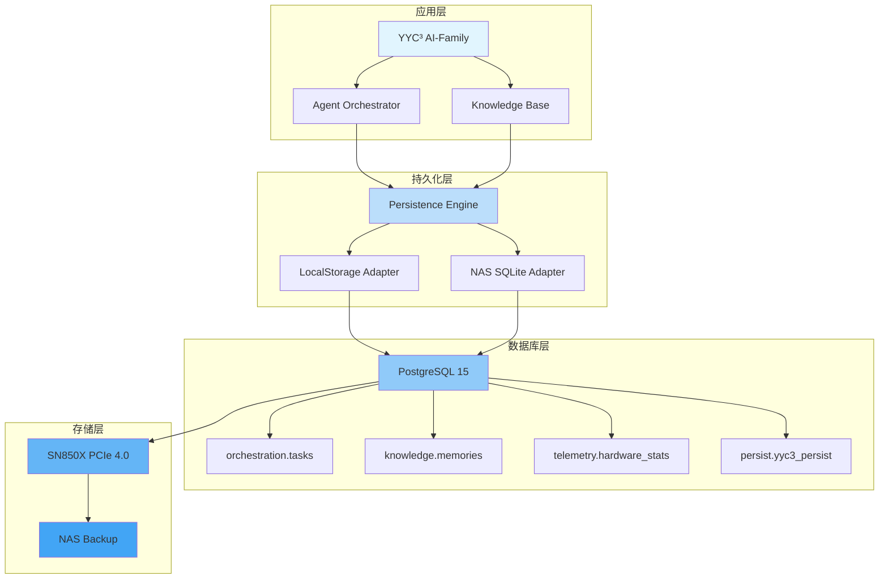

# YYC³ AI-Family - PostgreSQL 15 数据库 Schema

<div align="center">


# YYC³ AI-Family PostgreSQL 15 数据库 Schema

> ***YanYuCloudCube***
> *言启象限 | 语枢未来*
> ***Words Initiate Quadrants, Language Serves as Core for the Future***
> *万象归元于云枢 | 深栈智启新纪元*
> ***All things converge in the cloud pivot; Deep stacks ignite a new era of intelligence***

[](https://www.postgresql.org/)
[](https://github.com/pgvector/pgvector)
[](https://www.apple.com/mac-studio/)

</div>

---

## 概述

本文档描述 YYC³ AI-Family 项目的 PostgreSQL 15 数据库架构设计，专为 M4 Max + 128GB RAM + SN850X PCIe 4.0 SSD 硬件环境优化。

### 核心特性

- **内存驻留级性能**：32GB shared_buffers + 96GB effective_cache_size
- **向量检索支持**：pgvector 扩展实现本地知识库检索
- **高并发写入**：max_connections = 200，支持多 Agent 协同
- **实时遥测**：硬件监控数据持久化
- **智能编排**：任务生命周期管理与 Agent 结果存储

---

## 硬件配置

### 系统规格

```yaml
hostname: yyc3-22
chip: Apple M4 Max
cores:
  performance: 16
  efficiency: 40
ram: 128GB Unified
storage:
  main: 2TB SN850X (PCIe 4.0)
  extra: 2TB SN850X (PCIe 4.0)
network: 192.168.3.22
```

### 磁盘分区规划

| 挂载点 | 容量 | 用途 | 性能特性 |
|---------|-------|------|---------|
| `/` | 400GB | macOS 系统、开发环境、LLM 模型权重 | 极速读取 (Sequential Read) |
| `/Volumes/DataVault` | 1.2TB | PostgreSQL 15 数据目录、Vector 索引、应用数据库 | 随机读写优化 (Random IOPS) |
| `/Volumes/SwapStream` | 400GB | 编译缓存、WAL 日志、临时工作区、NAS 同步缓冲区 | 持续写入寿命优化 |

---

## PostgreSQL 15 配置

### 核心配置 (postgresql.conf)

```ini
# YYC3 Max Performance Tuning

port = 5433
max_connections = 200
shared_buffers = 32GB
effective_cache_size = 96GB
work_mem = 256MB
maintenance_work_mem = 4GB
wal_level = logical
max_worker_processes = 56
max_parallel_workers_per_gather = 16
random_page_cost = 1.1

# 检查点优化
checkpoint_completion_target = 0.9
checkpoint_timeout = 15min
max_wal_size = 16GB
min_wal_size = 4GB

# 查询优化
default_statistics_target = 100
effective_io_concurrency = 200

# 日志配置
log_destination = 'stderr'
logging_collector = on
log_directory = 'pg_log'
log_filename = 'postgresql-%Y-%m-%d_%H%M%S.log'
log_min_duration_statement = 1000
log_line_prefix = '%t [%p]: [%l-1] user=%u,db=%d,app=%a,client=%h '

# pgvector 扩展
shared_preload_libraries = 'vector'
```

---

## 数据库 Schema

### 1. 编排 Schema (orchestration)

存储任务生命周期和 Agent 协同结果。

#### 表：tasks

```sql
CREATE TABLE IF NOT EXISTS orchestration.tasks (
    id UUID PRIMARY KEY DEFAULT gen_random_uuid(),
    intent TEXT NOT NULL,
    mode VARCHAR(20) NOT NULL CHECK (mode IN ('pipeline', 'parallel', 'debate', 'ensemble', 'delegation')),
    status VARCHAR(20) NOT NULL DEFAULT 'pending' CHECK (status IN ('pending', 'executing', 'consensus', 'completed', 'failed')),
    agent_results JSONB DEFAULT '{}',
    mcp_tool_calls JSONB DEFAULT '{}',
    consensus_score FLOAT,
    metrics JSONB DEFAULT '{}',
    created_at TIMESTAMPTZ DEFAULT NOW(),
    updated_at TIMESTAMPTZ DEFAULT NOW(),
    completed_at TIMESTAMPTZ
);

CREATE INDEX idx_tasks_status ON orchestration.tasks(status);
CREATE INDEX idx_tasks_created_at ON orchestration.tasks(created_at DESC);
CREATE INDEX idx_tasks_mode ON orchestration.tasks(mode);
CREATE INDEX idx_tasks_agent_results ON orchestration.tasks USING GIN (agent_results);
```

**字段说明**：

| 字段 | 类型 | 说明 |
|------|------|------|
| id | UUID | 任务唯一标识符 |
| intent | TEXT | 用户意图描述 |
| mode | VARCHAR(20) | 协作模式 (pipeline/parallel/debate/ensemble/delegation) |
| status | VARCHAR(20) | 任务状态 (pending/executing/consensus/completed/failed) |
| agent_results | JSONB | Agent 输出结果集合 |
| mcp_tool_calls | JSONB | MCP 工具调用记录 |
| consensus_score | FLOAT | 共识评分 (0-1) |
| metrics | JSONB | 性能指标 (耗时/功耗/Token 使用) |
| created_at | TIMESTAMPTZ | 创建时间 |
| updated_at | TIMESTAMPTZ | 更新时间 |
| completed_at | TIMESTAMPTZ | 完成时间 |

---

### 2. 知识 Schema (knowledge)

结合 pgvector 实现本地向量记忆和语义检索。

#### 扩展：pgvector

```sql
CREATE EXTENSION IF NOT EXISTS vector;
```

#### 表：memories

```sql
CREATE TABLE IF NOT EXISTS knowledge.memories (
    id SERIAL PRIMARY KEY,
    content TEXT NOT NULL,
    embedding vector(1536),
    metadata JSONB DEFAULT '{}',
    tags TEXT[] DEFAULT '{}',
    created_at TIMESTAMPTZ DEFAULT NOW(),
    updated_at TIMESTAMPTZ DEFAULT NOW(),
    access_count INTEGER DEFAULT 0,
    last_accessed_at TIMESTAMPTZ
);

CREATE INDEX idx_memories_embedding ON knowledge.memories USING ivfflat (embedding vector_cosine_ops) WITH (lists = 100);
CREATE INDEX idx_memories_tags ON knowledge.memories USING GIN (tags);
CREATE INDEX idx_memories_created_at ON knowledge.memories(created_at DESC);
CREATE INDEX idx_memories_metadata ON knowledge.memories USING GIN (metadata);
```

**字段说明**：

| 字段 | 类型 | 说明 |
|------|------|------|
| id | SERIAL | 记录唯一标识符 |
| content | TEXT | 记忆内容 |
| embedding | vector(1536) | 1536 维向量 (适配 OpenAI Embeddings) |
| metadata | JSONB | 元数据 (来源、类型、关联等) |
| tags | TEXT[] | 标签数组 |
| created_at | TIMESTAMPTZ | 创建时间 |
| updated_at | TIMESTAMPTZ | 更新时间 |
| access_count | INTEGER | 访问计数 |
| last_accessed_at | TIMESTAMPTZ | 最后访问时间 |

**向量检索示例**：

```sql
-- 相似度搜索 (Top-K)
SELECT id, content, 1 - (embedding <=> '[0.1,0.2,...]') as similarity
FROM knowledge.memories
ORDER BY embedding <=> '[0.1,0.2,...]'
LIMIT 10;

-- 带过滤条件的搜索
SELECT id, content, 1 - (embedding <=> '[0.1,0.2,...]') as similarity
FROM knowledge.memories
WHERE tags @> ARRAY['important']::TEXT[]
ORDER BY embedding <=> '[0.1,0.2,...]'
LIMIT 10;
```

---

### 3. 监控 Schema (telemetry)

实时硬件遥测数据存储。

#### 表：hardware_stats

```sql
CREATE TABLE IF NOT EXISTS telemetry.hardware_stats (
    ts TIMESTAMPTZ DEFAULT NOW(),
    cpu_usage JSONB NOT NULL,
    ram_usage FLOAT NOT NULL,
    disk_latency FLOAT,
    gpu_load FLOAT,
    temperature FLOAT,
    disk_iops INTEGER,
    network_throughput FLOAT,
    process_count INTEGER
);

CREATE INDEX idx_hardware_stats_ts ON telemetry.hardware_stats(ts DESC);
CREATE INDEX idx_hardware_stats_ts_hourly ON telemetry.hardware_stats((date_trunc('hour', ts)));
```

**字段说明**：

| 字段 | 类型 | 说明 |
|------|------|------|
| ts | TIMESTAMPTZ | 时间戳 |
| cpu_usage | JSONB | CPU 使用率 (56 核数组) |
| ram_usage | FLOAT | 内存使用率 (0-100) |
| disk_latency | FLOAT | 磁盘延迟 (ms) |
| gpu_load | FLOAT | GPU 负载 (0-100) |
| temperature | FLOAT | 温度 (°C) |
| disk_iops | INTEGER | 磁盘 IOPS |
| network_throughput | FLOAT | 网络吞吐量 (Mbps) |
| process_count | INTEGER | 进程数量 |

**数据保留策略**：

```sql
-- 创建分区表 (按天分区)
CREATE TABLE telemetry.hardware_stats_daily (
    LIKE telemetry.hardware_stats INCLUDING DEFAULTS INCLUDING CONSTRAINTS
) PARTITION BY RANGE (ts);

-- 创建分区
CREATE TABLE telemetry.hardware_stats_2026_01 PARTITION OF telemetry.hardware_stats_daily
    FOR VALUES FROM ('2026-01-01') TO ('2026-02-01');

-- 自动清理旧数据 (保留 30 天)
DELETE FROM telemetry.hardware_stats
WHERE ts < NOW() - INTERVAL '30 days';
```

---

### 4. 持久化 Schema (persist)

全链路数据持久化存储。

#### 表：yyc3_persist

```sql
CREATE TABLE IF NOT EXISTS persist.yyc3_persist (
    id UUID PRIMARY KEY DEFAULT gen_random_uuid(),
    domain VARCHAR(50) NOT NULL,
    data JSONB NOT NULL,
    version INTEGER DEFAULT 1,
    synced BOOLEAN DEFAULT false,
    created_at TIMESTAMPTZ DEFAULT NOW(),
    updated_at TIMESTAMPTZ DEFAULT NOW()
);

CREATE INDEX idx_persist_domain ON persist.yyc3_persist(domain);
CREATE INDEX idx_persist_updated_at ON persist.yyc3_persist(updated_at DESC);
CREATE INDEX idx_persist_synced ON persist.yyc3_persist(synced);
CREATE INDEX idx_persist_data ON persist.yyc3_persist USING GIN (data);
```

**字段说明**：

| 字段 | 类型 | 说明 |
|------|------|------|
| id | UUID | 记录唯一标识符 |
| domain | VARCHAR(50) | 数据域 (chat_sessions/agent_sessions/metrics等) |
| data | JSONB | 数据内容 |
| version | INTEGER | 版本号 |
| synced | BOOLEAN | 是否已同步到 NAS |
| created_at | TIMESTAMPTZ | 创建时间 |
| updated_at | TIMESTAMPTZ | 更新时间 |

---

## 数据流架构



---

## 性能优化

### 1. 索引策略

- **主键索引**：所有表使用 UUID 主键
- **外键索引**：自动创建外键索引
- **JSONB GIN 索引**：agent_results, metadata, data
- **向量索引**：IVFFlat 索引优化向量检索
- **时间索引**：created_at, updated_at, ts

### 2. 查询优化

```sql
-- 使用 EXPLAIN ANALYZE 分析查询
EXPLAIN ANALYZE
SELECT * FROM orchestration.tasks
WHERE status = 'completed'
ORDER BY created_at DESC
LIMIT 100;

-- 使用 CTE 优化复杂查询
WITH ranked_tasks AS (
    SELECT *, ROW_NUMBER() OVER (PARTITION BY mode ORDER BY created_at DESC) as rn
    FROM orchestration.tasks
    WHERE status = 'completed'
)
SELECT * FROM ranked_tasks WHERE rn <= 10;
```

### 3. 连接池配置

```javascript
// Node.js pg 连接池配置
const pool = new Pool({
  host: '192.168.3.22',
  port: 5433,
  database: 'yyc3_orchestration',
  user: 'yyc3_max',
  password: process.env.DB_PASSWORD,
  max: 20,              // 最大连接数
  idleTimeoutMillis: 30000,
  connectionTimeoutMillis: 2000,
});
```

---

## 备份与恢复

### 1. WAL 备份

```bash
# 启用归档模式
archive_mode = on
archive_command = 'cp %p /Volumes/SwapStream/wal_archive/%f'

# 手动备份
pg_dump -h 192.168.3.22 -p 5433 -U yyc3_max -d yyc3_orchestration \
  -F c -b -v -f "/Volumes/DataVault/backup/yyc3_$(date +%Y%m%d).dump"
```

### 2. NAS 同步

```bash
# 定期同步到 NAS
rsync -avz --progress /Volumes/DataVault/postgres_data/ \
  backup-nas:/yyc3-snapshot/$(date +%Y%m%d)
```

### 3. 恢复流程

```bash
# 停止 PostgreSQL
pg_ctl stop -D /Volumes/DataVault/postgres_data

# 恢复备份
pg_restore -h 192.168.3.22 -p 5433 -U yyc3_max -d yyc3_orchestration \
  -v "/Volumes/DataVault/backup/yyc3_20260219.dump"

# 启动 PostgreSQL
pg_ctl start -D /Volumes/DataVault/postgres_data
```

---

## 监控与维护

### 1. 健康检查

```sql
-- 检查连接数
SELECT count(*) FROM pg_stat_activity;

-- 检查表大小
SELECT
    schemaname,
    tablename,
    pg_size_pretty(pg_total_relation_size(schemaname||'.'||tablename)) AS size
FROM pg_tables
WHERE schemaname IN ('orchestration', 'knowledge', 'telemetry', 'persist')
ORDER BY pg_total_relation_size(schemaname||'.'||tablename) DESC;

-- 检查索引使用情况
SELECT
    schemaname,
    tablename,
    indexname,
    idx_scan,
    idx_tup_read,
    idx_tup_fetch
FROM pg_stat_user_indexes
ORDER BY idx_scan DESC;
```

### 2. 定期维护

```sql
-- 分析表统计信息
ANALYZE orchestration.tasks;
ANALYZE knowledge.memories;
ANALYZE telemetry.hardware_stats;

-- 重建索引
REINDEX TABLE knowledge.memories;

-- 清理死元组
VACUUM FULL orchestration.tasks;
VACUUM FULL knowledge.memories;
```

---

## 安全配置

### 1. 访问控制

```ini
# pg_hba.conf
host    yyc3_orchestration    yyc3_max    192.168.3.0/24    scram-sha-256
host    yyc3_orchestration    yyc3_max    127.0.0.1/32    scram-sha-256
```

### 2. SSL/TLS 配置

```ini
ssl = on
ssl_cert_file = 'server.crt'
ssl_key_file = 'server.key'
ssl_ca_file = 'root.crt'
```

---

## 故障排除

### 问题 1：连接超时

**症状**：无法连接到 PostgreSQL

**解决方案**：

```bash
# 检查 PostgreSQL 状态
pg_ctl status -D /Volumes/DataVault/postgres_data

# 检查端口监听
netstat -an | grep 5433

# 检查防火墙
sudo pfctl -s rules | grep 5433
```

### 问题 2：性能下降

**症状**：查询响应变慢

**解决方案**：

```sql
-- 检查慢查询
SELECT query, mean_exec_time, calls
FROM pg_stat_statements
ORDER BY mean_exec_time DESC
LIMIT 10;

-- 检查锁等待
SELECT * FROM pg_stat_activity WHERE wait_event_type = 'Lock';
```

### 问题 3：磁盘空间不足

**症状**：无法写入数据

**解决方案**：

```bash
# 检查磁盘使用
df -h /Volumes/DataVault

# 清理 WAL 归档
rm -rf /Volumes/SwapStream/wal_archive/*

# 清理旧数据
psql -h 192.168.3.22 -p 5433 -U yyc3_max -d yyc3_orchestration \
  -c "DELETE FROM telemetry.hardware_stats WHERE ts < NOW() - INTERVAL '30 days';"
```

---

## 参考资料

- [PostgreSQL 15 Documentation](https://www.postgresql.org/docs/15/)
- [pgvector Documentation](https://github.com/pgvector/pgvector)
- [PostgreSQL Performance Tuning](https://wiki.postgresql.org/wiki/Performance_Optimization)
- [YYC³ Design System](../YYC3-AF-π³/README.md)

---

<div align="center">

> 「***YanYuCloudCube***」
> 「***<admin@0379.email>***」
> 「***Words Initiate Quadrants, Language Serves as Core for the Future***」
> 「***All things converge in the cloud pivot; Deep stacks ignite a new era of intelligence***」

*文档最后更新：2026-02-19*

</div>
