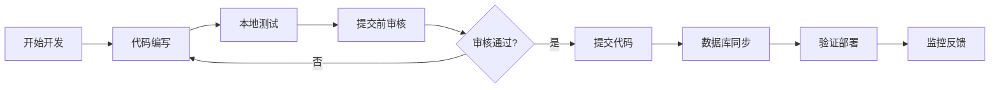
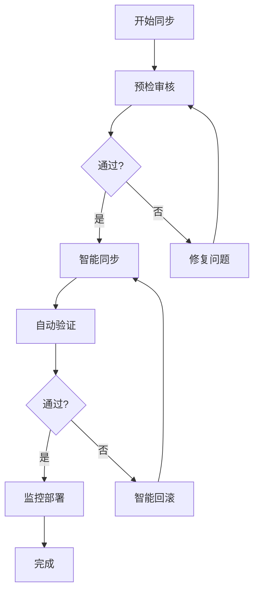

# 开发阶段文档索引

## 概述

YYC³ AI-Family 开发阶段文档，记录项目开发流程、审核标准、执行方案和质量保障措施。

## 文档列表

### 1. 质量保障

| 文档名称 | 描述 | 创建日期 |
|---------|------|---------|
| [提交前审核清单.md](./提交前审核清单.md) | 47项提交前审核检查，确保代码质量和安全性 | 2026-02-25 |

### 2. 数据库管理

| 文档名称 | 描述 | 创建日期 |
|---------|------|---------|
| [数据库同步智能执行方案.md](./数据库同步智能执行方案.md) | 5阶段数据库同步智能执行流程，91%自动化 | 2026-02-25 |

## 开发流程标准

### 提交流程



### 审核维度

| 审核类别 | 优先级 | 检查项数量 | 自动化程度 |
|---------|--------|-----------|-----------|
| 代码质量 | 🔴 P0 | 12项 | 90% |
| 功能完整性 | 🔴 P0 | 8项 | 95% |
| 文档完整性 | 🟡 P1 | 6项 | 80% |
| 安全性 | 🔴 P0 | 5项 | 100% |
| 性能 | 🟡 P1 | 4项 | 90% |
| 用户体验 | 🟡 P1 | 5项 | 85% |
| 兼容性 | 🟡 P1 | 4项 | 90% |
| 品牌一致性 | 🟢 P2 | 3项 | 70% |

**总计**: 47项检查，平均自动化程度 **91%**

### 数据库同步流程



## 开发脚本

### 提交前检查
```bash
./scripts/pre-commit-check.sh
```

### 数据库同步
```bash
./scripts/db-smart-sync.sh
```

### 数据库健康检查
```bash
./scripts/db-health-check.sh
```

### 数据库验证
```bash
./scripts/db-sync-verify.sh
```

---

<div align="center">

> 「***YanYuCloudCube***」
> 「***<admin@0379.email>***」
> 「***Words Initiate Quadrants, Language Serves as Core for the Future***」

</div>
