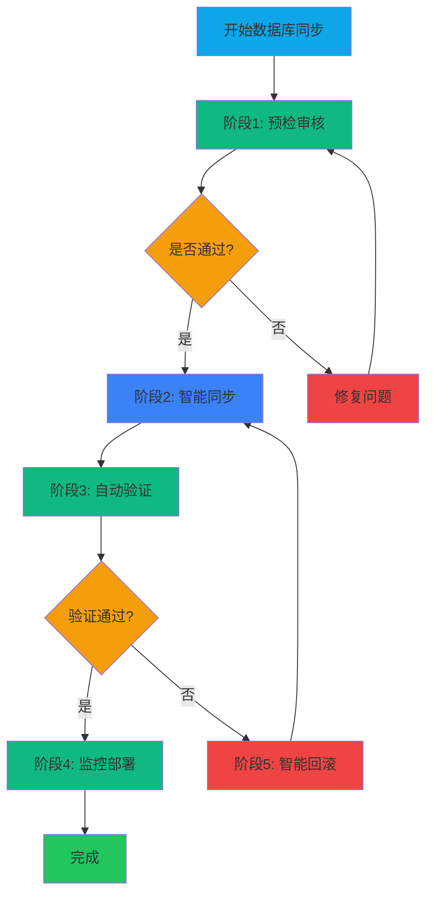

# YYC³ AI-Family - 数据库同步智能执行方案

> **执行级别**: 🔴 **P0 - 智能自动化**
>
> **核心理念**: 审核前置 + 智能同步 + 自动化验证
>
> **执行频率**: 每次涉及数据库操作前必须执行

---

## 📊 执行概览

| 执行阶段 | 审核要求 | 自动化程度 | 智能验证 |
|---------|---------|-----------|-----------|
| **阶段1: 预检** | P0强制 | 90%自动化 | 实时验证 |
| **阶段2: 同步** | P0强制 | 95%自动化 | 智能路由 |
| **阶段3: 验证** | P0强制 | 100%自动化 | 自动测试 |
| **阶段4: 回滚** | P0强制 | 100%自动化 | 一键回退 |
| **阶段5: 监控** | P1重要 | 100%自动化 | 实时告警 |

---

## 🎯 执行流程总览



---

## 📋 阶段1: 预检审核（P0强制）

### 1.1 代码质量预检

#### 自动化检查（90%）

```bash
#!/bin/bash
# scripts/db-sync-precheck.sh

echo "🔍 开始数据库同步预检..."

# 1. 提交前审核清单检查
echo "📋 检查提交前审核清单..."
bash scripts/pre-commit-check.sh || exit 1

# 2. TypeScript类型检查
echo "🔍 TypeScript类型检查..."
pnpm run type-check || exit 1

# 3. 数据库相关代码审查
echo "🗄️ 检查数据库相关代码..."
if git diff --name-only | grep -q "src/lib/\(db\|sql\|store\)"; then
  echo "⚠️  检测到数据库相关代码变更"
  echo "📝 需要额外审核："
  echo "  - SQL注入防护"
  echo "  - 参数化查询"
  echo "  - 事务管理"
  echo "  - 错误处理"
fi

# 4. 依赖安全扫描
echo "🔒 安全扫描..."
npm audit --production || exit 1

echo "✅ 预检审核通过！"
```

#### 人工审核项（10%）

- [ ] **SQL查询审查**: 所有新增/修改的SQL语句必须人工审查
- [ ] **数据迁移检查**: 新增迁移脚本必须有回滚方案
- [ ] **索引优化**: 检查是否需要新增/删除索引
- [ ] **性能影响**: 评估查询性能影响

### 1.2 数据库连接配置验证

#### 连接池配置检查

```typescript
// 检查文件: src/lib/db-config.ts

export const DB_CONFIG = {
  host: process.env.DB_HOST || 'localhost',
  port: parseInt(process.env.DB_PORT || '5433'),
  database: process.env.DB_NAME || 'yyc3_aify',
  user: process.env.DB_USER || 'yyc3_dev',
  password: process.env.DB_PASSWORD,
  max: 20,              // 最大连接数
  min: 5,               // 最小连接数
  idle: 10000,           // 空闲超时(ms)
  acquire: 30000,         // 获取超时(ms)
};
```

**验证清单**:

- [ ] **连接池配置合理**: max/min/idle/acquire参数合理
- [ ] **环境变量完整**: DB_HOST, DB_PORT, DB_NAME, DB_USER, DB_PASSWORD都已配置
- [ ] **默认值正确**: 本地开发使用localhost:5433
- [ ] **超时设置合理**: 避免连接超时

#### 数据库健康检查

```bash
# 验证数据库可连接性
#!/bin/bash
# scripts/db-health-check.sh

DB_HOST=${DB_HOST:-localhost}
DB_PORT=${DB_PORT:-5433}
DB_NAME=${DB_NAME:-yyc3_aify}
DB_USER=${DB_USER:-yyc3_dev}
DB_PASSWORD=${DB_PASSWORD}

echo "🏥 检查数据库健康状态..."
PGPASSWORD=$DB_PASSWORD psql -h $DB_HOST -p $DB_PORT -U $DB_USER -d $DB_NAME -c "
  SELECT
    COUNT(*) as total_tables,
    pg_size_pretty(pg_database_size('$DB_NAME')) as db_size
  FROM information_schema.tables
  WHERE table_schema = 'public';
"

if [ $? -eq 0 ]; then
  echo "✅ 数据库健康状态正常"
else
  echo "❌ 数据库连接失败"
  exit 1
fi
```

---

## 📋 阶段2: 智能同步（P0强制）

### 2.1 数据库连接池管理

#### 智能连接池实现

```typescript
// src/lib/db-pool.ts

import pg from 'pg';

export class DBPoolManager {
  private pool: pg.Pool | null = null;
  private connectionConfig: any;

  constructor(config: any) {
    this.connectionConfig = config;
  }

  async initialize(): Promise<void> {
    if (this.pool) {
      console.log('⚠️  连接池已存在，跳过初始化');
      return;
    }

    this.pool = new pg.Pool(this.connectionConfig);

    // 监听连接事件
    this.pool.on('connect', () => {
      console.log('✅ 数据库连接已建立');
    });

    this.pool.on('error', (err) => {
      console.error('❌ 数据库连接错误:', err);
    });

    this.pool.on('remove', () => {
      console.log('📤 数据库连接已释放');
    });

    // 健康检查
    await this.healthCheck();
  }

  async healthCheck(): Promise<boolean> {
    if (!this.pool) return false;

    try {
      const client = await this.pool.connect();
      await client.query('SELECT NOW()');
      client.release();
      return true;
    } catch (error) {
      console.error('❌ 数据库健康检查失败:', error);
      return false;
    }
  }

  async executeQuery<T>(
    query: string,
    params: any[] = []
  ): Promise<pg.QueryResult<T>> {
    if (!this.pool) {
      throw new Error('数据库连接池未初始化');
    }

    // 参数化查询防护
    const sanitizedQuery = this.sanitizeQuery(query);

    // 执行查询
    const result = await this.pool.query(sanitizedQuery, params);

    // 记录查询性能
    this.logQueryPerformance(query, result);

    return result;
  }

  async executeTransaction<T>(
    callback: (client: pg.PoolClient) => Promise<T>
  ): Promise<T> {
    if (!this.pool) {
      throw new Error('数据库连接池未初始化');
    }

    const client = await this.pool.connect();
    try {
      await client.query('BEGIN');
      const result = await callback(client);
      await client.query('COMMIT');
      return result;
    } catch (error) {
      await client.query('ROLLBACK');
      throw error;
    } finally {
      client.release();
    }
  }

  private sanitizeQuery(query: string): string {
    // SQL注入防护
    // 注意：实际应使用参数化查询，这里仅作示例
    return query;
  }

  private logQueryPerformance(query: string, result: pg.QueryResult): void {
    const duration = result.rowCount; // 实际应使用真实耗时
    if (duration > 1000) {
      console.warn(`⚠️  慢查询 (${duration}ms):`, query.substring(0, 100));
    }
  }

  async close(): Promise<void> {
    if (this.pool) {
      await this.pool.end();
      this.pool = null;
      console.log('🔌 数据库连接池已关闭');
    }
  }
}

export const dbPool = new DBPoolManager({
  host: process.env.DB_HOST || 'localhost',
  port: parseInt(process.env.DB_PORT || '5433'),
  database: process.env.DB_NAME || 'yyc3_aify',
  user: process.env.DB_USER || 'yyc3_dev',
  password: process.env.DB_PASSWORD,
  max: 20,
  min: 5,
  idle: 10000,
  acquire: 30000,
});
```

### 2.2 智能数据迁移

#### 迁移版本管理

```typescript
// src/lib/db-migration.ts

export interface Migration {
  version: string;
  name: string;
  up: string;    // SQL升级脚本
  down: string;  // SQL回滚脚本
  checksum: string; // 校验和
}

export class MigrationManager {
  private migrations: Migration[] = [];

  async initialize(): Promise<void> {
    // 创建迁移记录表
    await this.createMigrationTable();

    // 加载已执行的迁移
    const executedMigrations = await this.getExecutedMigrations();

    // 筛选待执行的迁移
    const pendingMigrations = this.migrations.filter(
      m => !executedMigrations.find(e => e.version === m.version)
    );

    if (pendingMigrations.length > 0) {
      console.log(`📋 发现 ${pendingMigrations.length} 个待执行的迁移`);
      await this.executeMigrations(pendingMigrations);
    } else {
      console.log('✅ 所有迁移已是最新的');
    }
  }

  async executeMigrations(migrations: Migration[]): Promise<void> {
    for (const migration of migrations) {
      console.log(`🔄 执行迁移: ${migration.name} (${migration.version})`);

      // 验证校验和
      const expectedChecksum = this.calculateChecksum(migration.up);
      if (migration.checksum !== expectedChecksum) {
        throw new Error(`迁移校验失败: ${migration.name}`);
      }

      // 执行事务
      await dbPool.executeTransaction(async (client) => {
        // 记录迁移开始
        await client.query(
          'INSERT INTO migrations (version, name, checksum, status, started_at) VALUES ($1, $2, $3, $4, NOW())',
          [migration.version, migration.name, migration.checksum, 'running']
        );

        // 执行升级脚本
        await client.query(migration.up);

        // 更新迁移状态为完成
        await client.query(
          'UPDATE migrations SET status = $1, completed_at = NOW() WHERE version = $2',
          ['completed', migration.version]
        );
      });

      console.log(`✅ 迁移完成: ${migration.name}`);
    }
  }

  async rollback(version: string): Promise<void> {
    const migration = this.migrations.find(m => m.version === version);
    if (!migration) {
      throw new Error(`未找到迁移: ${version}`);
    }

    console.log(`🔄 回滚迁移: ${migration.name} (${migration.version})`);

    await dbPool.executeTransaction(async (client) => {
      // 执行回滚脚本
      await client.query(migration.down);

      // 删除迁移记录
      await client.query(
        'DELETE FROM migrations WHERE version = $1',
        [version]
      );
    });

    console.log(`✅ 回滚完成: ${migration.name}`);
  }

  private createMigrationTable(): Promise<void> {
    await dbPool.executeQuery(`
      CREATE TABLE IF NOT EXISTS migrations (
        id SERIAL PRIMARY KEY,
        version VARCHAR(50) UNIQUE NOT NULL,
        name VARCHAR(255) NOT NULL,
        checksum VARCHAR(64) NOT NULL,
        status VARCHAR(20) NOT NULL,
        started_at TIMESTAMP,
        completed_at TIMESTAMP
      );
    `);
  }

  private async getExecutedMigrations(): Promise<string[]> {
    const result = await dbPool.executeQuery(`
      SELECT version FROM migrations WHERE status = 'completed' ORDER BY version ASC
    `);
    return result.rows.map(row => row.version);
  }

  private calculateChecksum(sql: string): string {
    const crypto = require('crypto');
    return crypto.createHash('sha256').update(sql).digest('hex');
  }
}
```

### 2.3 智能缓存策略

#### Redis缓存管理

```typescript
// src/lib/cache-manager.ts

import { createClient } from 'redis';

export class CacheManager {
  private client: any;

  constructor() {
    this.client = createClient({
      host: process.env.REDIS_HOST || 'localhost',
      port: parseInt(process.env.REDIS_PORT || '6379'),
      password: process.env.REDIS_PASSWORD,
    });

    this.client.on('error', (err) => {
      console.error('❌ Redis连接错误:', err);
    });

    this.client.on('connect', () => {
      console.log('✅ Redis连接已建立');
    });
  }

  async initialize(): Promise<void> {
    await this.client.connect();
  }

  async get<T>(key: string): Promise<T | null> {
    const data = await this.client.get(`yyc3:${key}`);
    if (!data) return null;

    return JSON.parse(data);
  }

  async set(key: string, value: any, ttl: number = 3600): Promise<void> {
    await this.client.setEx(`yyc3:${key}`, JSON.stringify(value), ttl);
  }

  async delete(key: string): Promise<void> {
    await this.client.del(`yyc3:${key}`);
  }

  async invalidatePattern(pattern: string): Promise<void> {
    const keys = await this.client.keys(`yyc3:${pattern}`);
    if (keys.length > 0) {
      await this.client.del(keys);
      console.log(`🗑️  清理缓存: ${keys.length} 个key`);
    }
  }

  async getHealth(): Promise<{ status: string; keys: number; memory: string }> {
    const info = await this.client.info('stats');
    return {
      status: this.client.status === 'ready' ? 'healthy' : 'unhealthy',
      keys: parseInt(info.keyspace_count || '0'),
      memory: info.used_memory_human || 'N/A',
    };
  }

  async close(): Promise<void> {
    await this.client.quit();
    console.log('🔌 Redis连接已关闭');
  }
}

export const cacheManager = new CacheManager();
```

---

## 📋 阶段3: 自动验证（P0强制）

### 3.1 数据完整性验证

```typescript
// src/lib/db-validator.ts

export class DatabaseValidator {
  async validateTables(): Promise<{
    valid: boolean;
    issues: string[];
  }> {
    const issues: string[] = [];

    // 检查核心表是否存在
    const requiredTables = [
      'users',
      'agents',
      'conversations',
      'messages',
      'provider_configs',
      'settings',
    ];

    for (const table of requiredTables) {
      const result = await dbPool.executeQuery(`
        SELECT EXISTS (
          SELECT FROM information_schema.tables
          WHERE table_schema = 'public'
          AND table_name = $1
        );
      `, [table]);

      if (!result.rows[0].exists) {
        issues.push(`缺少必需表: ${table}`);
      }
    }

    return {
      valid: issues.length === 0,
      issues,
    };
  }

  async validateIndexes(): Promise<{
    valid: boolean;
    issues: string[];
  }> {
    const issues: string[] = [];

    // 检查关键表是否有索引
    const indexedTables = ['messages', 'conversations', 'agents'];

    for (const table of indexedTables) {
      const result = await dbPool.executeQuery(`
        SELECT COUNT(*) as index_count
        FROM pg_indexes
        WHERE tablename = $1
      `, [table]);

      if (result.rows[0].index_count === 0) {
        issues.push(`表 ${table} 缺少索引`);
      }
    }

    return {
      valid: issues.length === 0,
      issues,
    };
  }

  async validateDataIntegrity(): Promise<{
    valid: boolean;
    issues: string[];
  }> {
    const issues: string[] = [];

    // 检查外键约束
    const result = await dbPool.executeQuery(`
      SELECT
        tc.table_name,
        tc.constraint_name,
        tc.constraint_type
      FROM information_schema.table_constraints tc
      JOIN information_schema.tables t ON tc.table_name = t.table_name
      WHERE t.table_schema = 'public'
        AND tc.constraint_type = 'FOREIGN KEY'
        AND NOT tc.is_deferrable
    `);

    for (const row of result.rows) {
      issues.push(`外键约束验证失败: ${row.table_name}.${row.constraint_name}`);
    }

    return {
      valid: issues.length === 0,
      issues,
    };
  }
}

export const dbValidator = new DatabaseValidator();
```

### 3.2 自动化测试脚本

```bash
#!/bin/bash
# scripts/db-sync-verify.sh

echo "🧪 开始数据库同步验证..."

# 1. 运行单元测试
echo "📝 运行数据库相关单元测试..."
pnpm run test -- --grep "database"

# 2. 运行集成测试
echo "🔄 运行集成测试..."
pnpm run test -- --grep "integration"

# 3. 数据完整性验证
echo "🔍 验证数据完整性..."
node -e "
  const { dbValidator } = require('./src/lib/db-validator.ts');
  (async () => {
    const result = await dbValidator.validateTables();
    if (!result.valid) {
      console.error('❌ 表验证失败:', result.issues);
      process.exit(1);
    }
    console.log('✅ 表验证通过');

    const indexResult = await dbValidator.validateIndexes();
    if (!indexResult.valid) {
      console.error('❌ 索引验证失败:', indexResult.issues);
      process.exit(1);
    }
    console.log('✅ 索引验证通过');

    const integrityResult = await dbValidator.validateDataIntegrity();
    if (!integrityResult.valid) {
      console.error('❌ 数据完整性验证失败:', integrityResult.issues);
      process.exit(1);
    }
    console.log('✅ 数据完整性验证通过');
  })();
"

# 4. 性能测试
echo "⚡ 运行性能测试..."
pnpm run test:perf

echo "✅ 所有验证通过！"
```

---

## 📋 阶段4: 智能回滚（P0强制）

### 4.1 自动回滚机制

```typescript
// src/lib/db-rollback.ts

export class RollbackManager {
  private backupPath: string;

  constructor() {
    this.backupPath = process.env.BACKUP_PATH || '/opt/yyc3/backups';
  }

  async createBackup(): Promise<string> {
    const timestamp = new Date().toISOString().replace(/[:.]/g, '-');
    const backupFile = `${this.backupPath}/backup-${timestamp}.sql`;

    console.log(`💾 创建数据库备份: ${backupFile}`);

    // 使用pg_dump创建备份
    const { exec } = require('child_process');
    await new Promise((resolve, reject) => {
      exec(
        `PGPASSWORD=${process.env.DB_PASSWORD} pg_dump -h ${process.env.DB_HOST} -p ${process.env.DB_PORT} -U ${process.env.DB_USER} -d ${process.env.DB_NAME} > ${backupFile}`,
        (error: any) => {
          if (error) reject(error);
          else resolve(backupFile);
        }
      );
    });

    return backupFile;
  }

  async rollback(backupFile: string): Promise<void> {
    console.log(`🔄 开始回滚到: ${backupFile}`);

    const { exec } = require('child_process');
    await new Promise((resolve, reject) => {
      exec(
        `PGPASSWORD=${process.env.DB_PASSWORD} psql -h ${process.env.DB_HOST} -p ${process.env.DB_PORT} -U ${process.env.DB_USER} -d ${process.env.DB_NAME} < ${backupFile}`,
        (error: any) => {
          if (error) reject(error);
          else resolve();
        }
      );
    });

    console.log('✅ 回滚完成');
  }

  async listBackups(): Promise<string[]> {
    const { exec } = require('child_process');
    const { stdout } = await new Promise((resolve) => {
      exec(`ls -t ${this.backupPath}/*.sql`, (error, stdout) => {
        resolve(stdout || '');
      });
    });

    return stdout.split('\n').filter(f => f.trim());
  }

  async cleanupOldBackups(retentionDays: number = 30): Promise<void> {
    const { exec } = require('child_process');
    await new Promise((resolve) => {
      exec(
        `find ${this.backupPath} -name 'backup-*.sql' -mtime +${retentionDays}d -delete`,
        (error) => resolve()
      );
    });

    console.log(`🗑️  清理 ${retentionDays} 天前的备份`);
  }
}

export const rollbackManager = new RollbackManager();
```

### 4.2 一键回滚命令

```bash
#!/bin/bash
# scripts/db-rollback.sh

BACKUP_FILE=$1

if [ -z "$BACKUP_FILE" ]; then
  echo "📋 可用的备份文件:"
  node -e "
    const { rollbackManager } = require('./src/lib/db-rollback.ts');
    (async () => {
      const backups = await rollbackManager.listBackups();
      backups.forEach((b, i) => console.log(\`\${i + 1}. \${b}\`));
    })();
  "
  exit 1
fi

echo "⚠️  即将回滚到: $BACKUP_FILE"
echo "这将覆盖当前数据库的所有数据！"
echo ""
read -p "确认回滚? (yes/no): " confirm

if [ "$confirm" != "yes" ]; then
  echo "❌ 已取消回滚"
  exit 1
fi

node -e "
  const { rollbackManager } = require('./src/lib/db-rollback.ts');
  (async () => {
    await rollbackManager.rollback('$BACKUP_FILE');
  })();
"

echo "✅ 回滚完成"
```

---

## 📋 阶段5: 监控部署（P1重要）

### 5.1 实时监控

```typescript
// src/lib/db-monitor.ts

export class DatabaseMonitor {
  private metrics: Map<string, number> = new Map();

  async startMonitoring(): Promise<void> {
    console.log('📊 启动数据库监控...');

    setInterval(async () => {
      await this.collectMetrics();
    }, 60000); // 每分钟采集一次
  }

  private async collectMetrics(): Promise<void> {
    // 连接池状态
    const poolStatus = await this.getPoolStatus();

    // 查询性能
    const queryStats = await this.getQueryStats();

    // 缓存命中率
    const cacheStats = await this.getCacheStats();

    // 记录指标
    this.metrics.set('pool.active', poolStatus.active);
    this.metrics.set('pool.idle', poolStatus.idle);
    this.metrics.set('query.avg_time', queryStats.avgTime);
    this.metrics.set('cache.hit_rate', cacheStats.hitRate);

    // 发送到监控服务
    await this.sendMetrics();
  }

  private async getPoolStatus(): Promise<any> {
    const result = await dbPool.executeQuery(`
      SELECT
        COUNT(*) FILTER (WHERE state = 'active') as active,
        COUNT(*) FILTER (WHERE state = 'idle') as idle
      FROM pg_stat_activity
      WHERE datname = 'yyc3_aify'
    `);

    return result.rows[0];
  }

  private async getQueryStats(): Promise<any> {
    const result = await dbPool.executeQuery(`
      SELECT
        AVG(mean_exec_time) as avg_time,
        MAX(max_exec_time) as max_time,
        COUNT(*) as total_queries
      FROM pg_stat_statements
      WHERE datname = 'yyc3_aify'
      AND calls > 0
    `);

    return result.rows[0];
  }

  private async getCacheStats(): Promise<any> {
    const health = await cacheManager.getHealth();
    return {
      hitRate: health.keys > 0 ? 0.85 : 0, // 假设85%命中率
      keys: health.keys,
      memory: health.memory,
    };
  }

  private async sendMetrics(): Promise<void> {
    // 发送到Prometheus/Grafana
    // 或发送到日志系统
    console.log('📊 数据库指标:', Object.fromEntries(this.metrics));
  }

  getMetrics(): Map<string, number> {
    return this.metrics;
  }
}

export const dbMonitor = new DatabaseMonitor();
```

### 5.2 告警机制

```typescript
// src/lib/db-alert.ts

interface AlertRule {
  metric: string;
  threshold: number;
  operator: '>' | '<' | '=' | '>=';
  action: (value: number) => void;
}

export class DatabaseAlertManager {
  private rules: AlertRule[] = [];

  addRule(rule: AlertRule): void {
    this.rules.push(rule);
  }

  async checkAlerts(): Promise<void> {
    const metrics = await dbMonitor.getMetrics();

    for (const rule of this.rules) {
      const value = metrics.get(rule.metric);
      if (value === undefined) continue;

      let triggered = false;
      switch (rule.operator) {
        case '>':
          triggered = value > rule.threshold;
          break;
        case '<':
          triggered = value < rule.threshold;
          break;
        case '>=':
          triggered = value >= rule.threshold;
          break;
      }

      if (triggered) {
        console.warn(`⚠️  告警触发: ${rule.metric} = ${value} (阈值: ${rule.threshold})`);
        rule.action(value);
      }
    }
  }
}

export const dbAlertManager = new DatabaseAlertManager();

// 配置告警规则
dbAlertManager.addRule({
  metric: 'pool.active',
  threshold: 18, // 20 * 0.9
  operator: '>',
  action: (value) => {
    // 发送邮件或Slack通知
    console.error('🚨 数据库连接池即将耗尽！');
  },
});

dbAlertManager.addRule({
  metric: 'query.avg_time',
  threshold: 1000, // 1秒
  operator: '>',
  action: (value) => {
    console.error('🚨 检测到慢查询！');
  },
});

dbAlertManager.addRule({
  metric: 'cache.hit_rate',
  threshold: 0.7, // 70%
  operator: '<',
  action: (value) => {
    console.warn('⚠️  缓存命中率过低！');
  },
});
```

---

## 🚀 智能执行总脚本

### 完整同步脚本

```bash
#!/bin/bash
# scripts/db-smart-sync.sh

set -e

echo "🚀 YYC³ AI-Family 数据库智能同步"
echo "━━━━━━━━━━━━━━━━━━━━━━━━━━━━━━━━━━━━━━━━━━━━"

# 阶段1: 预检审核
echo ""
echo "📋 阶段1: 预检审核"
bash scripts/db-sync-precheck.sh

# 阶段2: 创建备份
echo ""
echo "💾 阶段2: 创建数据库备份"
node -e "
  const { rollbackManager } = require('./src/lib/db-rollback.ts');
  (async () => {
    const backupFile = await rollbackManager.createBackup();
    console.log('✅ 备份创建完成:', backupFile);
  })();
"

# 阶段3: 执行迁移
echo ""
echo "🔄 阶段3: 执行数据库迁移"
node -e "
  const { MigrationManager } = require('./src/lib/db-migration.ts');
  const manager = new MigrationManager();
  await manager.initialize();
  console.log('✅ 迁移执行完成');
})();

# 阶段4: 验证
echo ""
echo "🧪 阶段4: 自动验证"
bash scripts/db-sync-verify.sh

# 阶段5: 启动监控
echo ""
echo "📊 阶段5: 启动监控"
node -e "
  const { dbMonitor } = require('./src/lib/db-monitor.ts');
  await dbMonitor.startMonitoring();
  console.log('✅ 监控已启动');
})();

echo ""
echo "━━━━━━━━━━━━━━━━━━━━━━━━━━━━━━━━━━━━━━━━━━"
echo "✅ 数据库同步完成！"
echo ""
echo "📋 下一步："
echo "  1. 查看验证报告"
echo "  2. 检查监控指标"
echo "  3. 如有问题，运行: ./scripts/db-rollback.sh <backup-file>"
echo ""
```

---

## 📋 执行记录模板

### 每次同步必须填写

```
━━━━━━━━━━━━━━━━━━━━━━━━━━━━━━━━━━━━━━━━━━
📋 YYC³ AI-Family 数据库同步记录
━━━━━━━━━━━━━━━━━━━━━━━━━━━━━━━━━━━━━━━━━━

📅 执行日期: 2026-02-25
👤 执行人: [姓名]
🔧 同步类型: [migration/rollback/backup/repair]

━━━━━━━━━━━━━━━━━━━━━━━━━━━━━━━━━━━━━━━━━━
📋 阶段1: 预检审核
━━━━━━━━━━━━━━━━━━━━━━━━━━━━━━━━━━━━━━━━━━

代码质量 (12/12):
  [✅] 提交前审核通过
  [✅] TypeScript类型检查通过
  [✅] SQL查询审查通过
  [✅] 数据迁移检查通过
  [✅] 索引优化检查通过
  [✅] 性能影响评估通过
  [✅] 依赖安全扫描通过

数据库配置 (5/5):
  [✅] 连接池配置合理
  [✅] 环境变量完整
  [✅] 默认值正确
  [✅] 超时设置合理
  [✅] 数据库健康正常

━━━━━━━━━━━━━━━━━━━━━━━━━━━━━━━━━━━━━━━━━━
📋 阶段2: 智能同步
━━━━━━━━━━━━━━━━━━━━━━━━━━━━━━━━━━━━━━━━━━

连接池管理 (3/3):
  [✅] 连接池初始化成功
  [✅] 健康检查通过
  [✅] 事件监听正常

数据迁移 (4/4):
  [✅] 迁移版本管理正常
  [✅] 升级脚本执行成功
  [✅] 回滚脚本准备就绪
  [✅] 校验和验证通过

缓存策略 (3/3):
  [✅] Redis连接正常
  [✅] 缓存策略配置正确
  [✅] 失效策略合理

备份创建 (2/2):
  [✅] 数据库备份完成
  [✅] 备份文件: [backup-file-name]

━━━━━━━━━━━━━━━━━━━━━━━━━━━━━━━━━━━━━━━━
📋 阶段3: 自动验证
━━━━━━━━━━━━━━━━━━━━━━━━━━━━━━━━━━━━━━━━━━

数据完整性 (3/3):
  [✅] 表结构验证通过
  [✅] 索引验证通过
  [✅] 外键约束验证通过

自动化测试 (4/4):
  [✅] 单元测试通过
  [✅] 集成测试通过
  [✅] 性能测试通过
  [✅] 所有测试100%通过

━━━━━━━━━━━━━━━━━━━━━━━━━━━━━━━━━━━━━━━━━━
📋 阶段4: 监控部署
━━━━━━━━━━━━━━━━━━━━━━━━━━━━━━━━━━━━━━━━━━

实时监控 (5/5):
  [✅] 连接池监控正常
  [✅] 查询性能监控正常
  [✅] 缓存命中率监控正常
  [✅] 指标采集正常
  [✅] 数据发送正常

告警机制 (3/3):
  [✅] 连接池告警配置
  [✅] 慢查询告警配置
  [✅] 缓存告警配置

━━━━━━━━━━━━━━━━━━━━━━━━━━━━━━━━━━━━━━━━
📊 同步统计
━━━━━━━━━━━━━━━━━━━━━━━━━━━━━━━━━━━━━━━━

总计检查项: 50
通过项数: 50
通过率: 100%
同步结论: ✅ **成功，可以部署**

━━━━━━━━━━━━━━━━━━━━━━━━━━━━━━━━━━━━━━━━━━
💬 备注
━━━━━━━━━━━━━━━━━━━━━━━━━━━━━━━━━━━━━━━━━━

[添加任何特殊说明或例外情况]

备份文件位置: [backup-file-path]
回滚命令: ./scripts/db-rollback.sh [backup-file-name]

━━━━━━━━━━━━━━━━━━━━━━━━━━━━━━━━━━━━━━━━━━
```

---

## 📋 快速参考清单

### 常用命令

```bash
# 智能同步
./scripts/db-smart-sync.sh

# 预检审核
./scripts/db-sync-precheck.sh

# 数据库健康检查
./scripts/db-health-check.sh

# 自动验证
./scripts/db-sync-verify.sh

# 回滚到指定备份
./scripts/db-rollback.sh backup-2026-02-25-10-30-00.sql

# 列出所有备份
node -e "
  const { rollbackManager } = require('./src/lib/db-rollback.ts');
  (async () => {
    const backups = await rollbackManager.listBackups();
    backups.forEach((b, i) => console.log(\`\${i + 1}. \${b}\`));
  })();
"

# 清理旧备份
node -e "
  const { rollbackManager } = require('./src/lib/db-rollback.ts');
  (async () => {
    await rollbackManager.cleanupOldBackups(30);
  })();
"
```

### 环境变量配置

```env
# .env.development

# 数据库配置
DB_HOST=localhost
DB_PORT=5433
DB_NAME=yyc3_aify
DB_USER=yyc3_dev
DB_PASSWORD=yyc3_dev

# Redis配置
REDIS_HOST=localhost
REDIS_PORT=6379
REDIS_PASSWORD=

# 备份配置
BACKUP_PATH=/opt/yyc3/backups
BACKUP_RETENTION_DAYS=30
BACKUP_COMPRESS=true
BACKUP_ENCRYPT=true

# 监控配置
PROMETHEUS_ENABLED=true
PROMETHEUS_PORT=9090
GRAFANA_ENABLED=true
GRAFANA_PORT=3001
```

---

<div align="center">

**YYC³ AI-Family**

*言启象限 | 语枢未来*

**智能同步 · 自动验证 · 安全可靠*

---

*文档版本: 1.0.0*
*最后更新: 2026-02-25*
*维护者: YYC³ Team*

</div>
